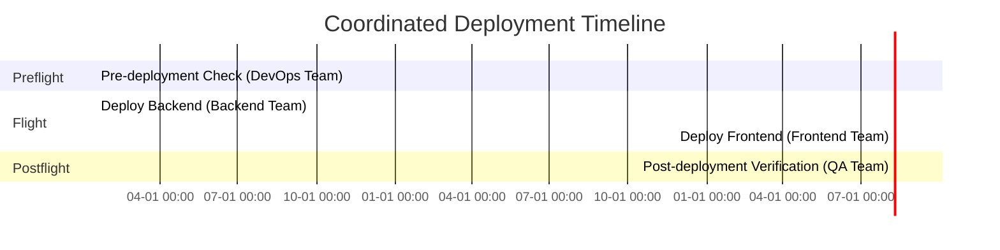
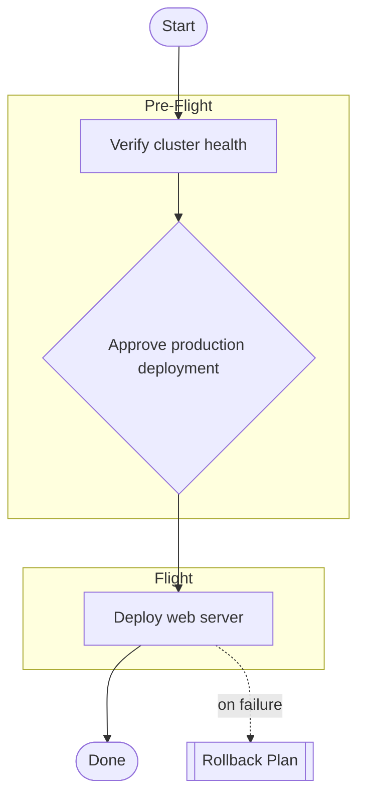

# 🤖 SAMARITAN

**Operations as Code CLI for SRE Teams**

Define operations once, execute anywhere with complete audit trails, evidence collection, and integrated approval workflows.

[](https://badge.fury.io/js/samaritan)
[](https://github.com/eric4545/samaritan/actions)

## 🚀 Quick Start

**Requires Node.js 22+.** Run SAMARITAN directly from GitHub without installation:

```bash
# Validate an operation definition
npx github:eric4545/samaritan validate my-operation.yaml

# Execute an operation
npx github:eric4545/samaritan run my-operation.yaml --env production

# Generate operation manual
npx github:eric4545/samaritan generate manual my-operation.yaml

# Use specific branch (for testing/development)
npx github:eric4545/samaritan#branch-name validate my-operation.yaml
```

## 📋 Table of Contents

- [Core Concepts](#-core-concepts)
- [CLI Commands](#-cli-commands)
- [Operation Definition](#-operation-definition)
- [Interactive Execution & Run Commands](#-interactive-execution--run-commands)
- [Execution Workflows](#-execution-workflows)
- [Examples](#-examples)
- [Roadmap](#-roadmap)
- [Development](#-development)

## 🎯 Core Concepts

### Operations as Code
- **YAML-defined procedures** stored in Git with version control
- **Environment-specific variables** for preprod/production deployment
- **Manual operation procedures** with evidence tracking
- **Approval gates** for compliance workflows

### Key Features
- **Manual Execution**: Present clear instructions for operator execution
- **Documentation Generation**: Create comprehensive manuals from YAML definitions
- **Validation**: Verify operation definitions and catch errors early
- **Multi-Environment**: Support for staging, production, and custom environments

### Evidence & Audit
- **Evidence tracking** - Document required evidence for each step
- **Evidence results** - Embed pre-captured evidence directly in generated manuals
- **Git metadata** - Complete traceability with commit info
- **Structured documentation** - Generate manuals with evidence requirements
- **Audit-ready formats** - Markdown and Confluence outputs

> **Note**: Automatic evidence collection (screenshots, log capture, video recording) is planned for v2.0. See [ROADMAP.md](ROADMAP.md) for details. Current v1.0 supports embedding pre-captured evidence via the `evidence.results` field.

#### Evidence Results (Pre-captured Evidence)

You can embed pre-captured evidence directly into generated manuals using the `evidence.results` field. This is useful for:
- **Pre-approved procedures**: Include evidence from rehearsal/staging runs
- **Template manuals**: Show expected outcomes with screenshots
- **Post-execution documentation**: Update manuals with actual results
- **Audit compliance**: Maintain complete evidence trail in version control

**Example with file references:**
```yaml
steps:
  - name: Deploy Application
    type: manual
    instruction: |
      Deploy application to Kubernetes:
      ```bash
      kubectl apply -f deployment.yaml -n ${NAMESPACE}
      ```
    evidence:
      required: true
      types: [screenshot, command_output]
      results:
        staging:
          - type: screenshot
            file: ./evidence/staging-dashboard.png
            description: Kubernetes dashboard showing 3 pods running
          - type: command_output
            file: ./evidence/staging-deploy.log
            description: Deployment output from kubectl
        production:
          - type: screenshot
            file: ./evidence/prod-dashboard.png
            description: Kubernetes dashboard showing 5 pods running
          - type: command_output
            file: ./evidence/prod-deploy.log
            description: Deployment output from kubectl
```

**Example with inline content:**
```yaml
steps:
  - name: Verify Database Connection
    type: manual
    instruction: Check database connectivity
    evidence:
      required: true
      types: [command_output, log]
      results:
        staging:
          - type: command_output
            content: |
              deployment.apps/web-server created
              service/web-server created
              NAME         READY   STATUS    RESTARTS   AGE
              pod/web-0    1/1     Running   0          10s
              pod/web-1    1/1     Running   0          10s
            description: Successful staging deployment output
          - type: log
            content: |
              [2025-10-16 10:30:00] INFO: Application started
              [2025-10-16 10:30:05] INFO: Database connection established
              [2025-10-16 10:30:10] INFO: Ready to accept connections
            description: Application startup logs
        production:
          - type: command_output
            content: |
              deployment.apps/web-server created
              service/web-server created
              NAME         READY   STATUS    RESTARTS   AGE
              pod/web-0    1/1     Running   0          10s
              pod/web-1    1/1     Running   0          10s
              pod/web-2    1/1     Running   0          10s
            description: Production deployment output
```

**Generated Manual Rendering:**

Evidence results are automatically rendered in generated manuals:
- **Screenshots/Photos** (file): Rendered as embedded images
- **Other files**: Rendered as download links
- **`command_output`/`log` files**: File content is read and embedded as a code block (all formats, including Confluence ADF)
- **Inline content**: Rendered as code blocks (bash for command_output, text for others)
- **Descriptions**: Displayed above the evidence content

When `command_output` evidence is required (or optional) but no results have been
captured yet, every format (Markdown, single-env Markdown, Confluence markup, and ADF)
renders a `# Paste command output here` code block so the operator knows where to record
the output. Other evidence types (e.g. `screenshot`, `log`) show only the evidence
metadata, with no placeholder body.

**Evidence Result Schema:**
```yaml
evidence:
  required: true              # Optional: whether evidence is required
  types: [screenshot, log]    # Optional: expected evidence types
  results:                    # Optional: pre-captured evidence, keyed by environment name
    staging:                  # Environment name (must match an environment defined in the operation)
      - type: screenshot      # Required: evidence type
        file: ./path/to/file  # Either 'file' OR 'content' required
        description: Description text  # Optional
      - type: command_output
        content: |            # Inline content (alternative to 'file')
          Command output here
        description: Description text  # Optional
    production:
      - type: screenshot
        file: ./evidence/prod/dashboard.png
        description: Production dashboard
```

**Supported Evidence Types:**
- `screenshot` - UI screenshots (renders as image if file path provided)
- `photo` - Photos (renders as image if file path provided)
- `log` - Log files or log content
- `command_output` - Shell command output
- `video` - Video recordings
- `document` - PDF or document files
- `config` - Configuration file snapshots
- `custom` - Custom evidence types

See `tests/fixtures/operations/features/evidence-with-results.yaml` for a complete example.

#### Environment-Specific Evidence in Shared Steps

When defining shared steps that will be included via `uses:`, define evidence types in the step file as documentation. Each operation that includes the file adds its own `evidence.results` with environment-specific captured evidence:

```yaml
# ./common/health-checks.yaml
- name: Check AFD Health
  type: manual
  instruction: |
    Check AFD health status:
    ```bash
    curl https://${AFD_ENDPOINT}/health
    ```
  evidence:
    required: true
    types: [command_output, screenshot]
```

```yaml
# main-operation.yaml
steps:
  - uses: ./common/health-checks.yaml
    with:
      AFD_ENDPOINT: ${AFD_ENDPOINT}

  # Steps from the file expand inline; add evidence.results
  # directly on individual steps or via variants for per-env evidence
```

See `tests/fixtures/operations/features/evidence-with-results.yaml` for a complete example.

### Step Composition (`uses:`)

SAMARITAN supports inline step composition using the `uses:` directive — inspired by GitHub Actions. Point at a file, and all its steps expand inline at that position. No registration, no IDs to remember.

```yaml
steps:
  - uses: ./tasks/database-backup.yaml        # all steps from file expand here
  - uses: ./tasks/health-checks.yaml          # same file, with variables
    with:
      ENDPOINT: ${ENDPOINT}
      TIMEOUT: 60
  - uses: ./tasks/health-checks.yaml          # same file again, different vars
    with:
      TIMEOUT: 120
```

#### File Sources

`uses:` accepts local paths, HTTPS URLs, or GitHub shorthands:

```yaml
steps:
  # Local file (relative to this operation)
  - uses: ./templates/health-checks.yaml
    with: { ENDPOINT: https://api.example.com }

  # HTTPS URL
  - uses: https://raw.githubusercontent.com/org/repo/main/templates/deploy.yaml
    with: { SERVICE: my-app }

  # GitHub shorthand  github:owner/repo//path@ref
  - uses: github:org/ops-templates//health-checks.yaml@v2.1.0
    with: { NAMESPACE: production }
```

#### Writing Reusable Step Files

Step files can be a bare step array or a full operation file:

```yaml
# tasks/health-checks.yaml — bare step array
- name: Check API Health
  type: automatic
  command: curl -f ${ENDPOINT}/health
  timeout: ${TIMEOUT}

- name: Verify Database
  type: automatic
  command: kubectl exec ${SERVICE_NAME} -- nc -zv ${DB_HOST} 5432
```

```yaml
# tasks/k8s-deploy.yaml — full operation format (steps: field is extracted)
name: Kubernetes Deployment Steps
version: 1.0.0
common_variables:
  REPLICAS: 2          # default — overridable via with:
steps:
  - name: Apply Manifests
    type: automatic
    command: kubectl apply -f k8s/${SERVICE_NAME}.yaml -n ${NAMESPACE}
  - name: Wait for Rollout
    type: automatic
    command: kubectl rollout status deployment/${SERVICE_NAME} -n ${NAMESPACE}
```

#### Complete Example

```yaml
name: Microservice Deployment
version: 2.0.0
environments:
  - name: staging
    variables:
      ENDPOINT: https://staging.api.com
      DB_HOST: staging-db
      SERVICE_NAME: my-service
      NAMESPACE: staging
  - name: production
    variables:
      ENDPOINT: https://api.example.com
      DB_HOST: prod-db
      SERVICE_NAME: my-service
      NAMESPACE: production

steps:
  # Pre-deployment health checks
  - uses: ./tasks/health-checks.yaml
    with:
      ENDPOINT: ${ENDPOINT}
      DB_HOST: ${DB_HOST}
      SERVICE_NAME: ${SERVICE_NAME}
      TIMEOUT: 60

  - name: Deploy Application
    type: manual
    instruction: Deploy the app

  # Post-deployment health checks (same file, stricter timeout)
  - uses: ./tasks/health-checks.yaml
    with:
      ENDPOINT: ${ENDPOINT}
      DB_HOST: ${DB_HOST}
      SERVICE_NAME: ${SERVICE_NAME}
      TIMEOUT: 120
```

**How it works:**
1. File is loaded (local, HTTPS, or GitHub)
2. Steps are extracted (from bare array or `steps:` field)
3. `${VAR}` placeholders are substituted with values from `with:`
4. Steps expand inline at the `uses:` position
5. Generated manuals show the fully expanded, substituted steps

**Variable substitution:**
- All `${VAR}` placeholders must be satisfied by `with:` or `common_variables` defaults
- Type-preserving: `timeout: ${TIMEOUT}` with `TIMEOUT: 60` → `timeout: 60` (number, not string)
- Omit `with:` entirely if the file has no `${VAR}` placeholders

#### Block-scoped pre-flight

Generated manuals group steps into Pre-Flight / Flight / Post-Flight phases. A
reused file can carry its **own** `phase: preflight` checks (e.g. a migration
block that verifies the DB is reachable before migrating). Those checks stay
**local to the reused block** — they render right before that block's steps in
the Flight phase, not hoisted into the operation's top-level Pre-Flight section.
The operation's own top-level `phase: preflight` steps still group into the
global Pre-Flight section as usual. This is automatic; no extra configuration is
needed. (A reused block whose steps are *all* preflight does group into the
top-level Pre-Flight section, since it is purely a set of checks.)

See `examples/scoped-preflight.yaml` (+ `examples/templates/db-migration.yaml`).

**Example files:**
- `examples/templates/health-checks.yaml` — service health verification
- `examples/templates/kubernetes-deployment.yaml` — K8s deployment workflow
- `examples/templates/notifications.yaml` — team notification steps
- `examples/templates/db-migration.yaml` — migration block with local pre-flight

See `examples/deployment-with-templates.yaml` for a complete example.

## 🛠 CLI Commands

### Core Operations

```bash
# Validate operation definition
npx github:eric4545/samaritan validate <operation.yaml> [options]
  --strict              Enable strict validation with best practices
  --env <environment>   Validate for specific environment
  --lint                Lint step commands/scripts with shellcheck
  -v, --verbose         Verbose output

# Execute an operation interactively
npx github:eric4545/samaritan run <operation.yaml> [options]
  --env <environment>       Target environment (required)
  --var KEY=VALUE           Override a variable (repeatable)
  --dry-run                 Preview full plan without executing
  --mock                    Replay each step's expect against its
                            evidence.results output (no tmux); exits non-zero
                            on any failure — handy in CI
  --auto-approve            Skip manual approval prompts and switch to automatic mode
                            (does NOT execute commands non-interactively; see note below)
  -m, --mode <mode>         Execution mode: sidecar | manual | automatic | hybrid (default: sidecar)
  --attach <tmux-target>    Attach to an existing tmux pane for sidecar capture
  --report <dir>            Write an EXTRA copy of the Markdown report to <dir>
                            (a report is always written beside the operation — see below)
  --continue-on-error       Continue execution even if a step fails

# List saved run sessions (resumable by default)
npx github:eric4545/samaritan sessions [options]
  -a, --all             Include completed and cancelled sessions

# Resume a paused or aborted run
npx github:eric4545/samaritan resume <session-id> [options]
  --from-step <number>  Resume from a specific step number
  --auto-approve        Auto-approve remaining manual steps

# Generate documentation
npx github:eric4545/samaritan generate manual <operation.yaml> [options]
  --output <file>       Output file (default: stdout)
  --format <md|confluence>  Output format (default: md)
  --env <environment>   Single-environment heading-based Markdown (no tables); omit for multi-env table format
  --all-envs            Generate one manual per environment in the operation (e.g. operation_dev.md, operation_prod.md)
  --output-dir <dir>    Directory for --all-envs output (default: current directory)
  --prefix <name>       Base filename for --all-envs output (default: operation file name); env name is the suffix
  --resolve-vars        Resolve variables to actual values (ready-to-execute commands)
  --gantt               Include Mermaid Gantt chart for timeline visualization

# Generate Confluence documentation
npx github:eric4545/samaritan generate confluence <operation.yaml> [options]
  --output <file>       Output Confluence storage format file
  --env <environment>   Generate for specific environment only
  --gantt               Include Gantt chart for timeline visualization

# Compare how steps render across two environments
npx github:eric4545/samaritan diff <operation.yaml> <envA> <envB> [options]
  -o, --output <file>   Write Markdown report to file (in addition to terminal output)

# Generate evidence report from a session log
npx github:eric4545/samaritan report <session.jsonl> [options]
  --output <file>       Output Markdown file (default: stdout)

# Export JSON schema for operations
npx github:eric4545/samaritan schema [options]
  -o, --output <file>   Output file (default: stdout)
  -f, --format <format> Output format: json or yaml (default: json)
```

> **Note on `--auto-approve` and `automatic` mode**: `--auto-approve`
> switches the default execution mode to `automatic` and skips manual
> approval prompts. It does **not** execute commands non-interactively —
> SAMARITAN does not run shell commands on your behalf. In `automatic`
> mode, commands are sent to the attached tmux pane and `step.expect` is
> verified against the captured output, but this only works within the
> interactive `run` loop (an attached/spawned tmux session is required).
> Non-interactive command execution (run-and-forget with no tmux) is a
> planned but unimplemented feature — see [ROADMAP.md](ROADMAP.md) Phase 2.1.

### Project Management

```bash
# Initialize new SAMARITAN project
npx github:eric4545/samaritan init [directory]

# Create operation from template
npx github:eric4545/samaritan create operation [options]
  --template <type>     Operation template (deployment, backup, incident-response, maintenance)
  --env <environments>  Target environments (comma-separated)
```


### Linting step commands (`--lint`)

Pass `--lint` to `validate` to run every step's inline `command` (and the
contents of referenced `script` files) through [shellcheck](https://www.shellcheck.net/):

```bash
npx github:eric4545/samaritan validate deployment.yaml --lint
```

- Findings are reported as **warnings** by default (they don't fail validation);
  with `--strict` they become **errors**.
- shellcheck is **optional** — if it isn't installed, linting is skipped with a
  notice and validation proceeds normally (CI stays green without it).
- Each finding shows the step, source (`command`/`script`), line, and SC code,
  e.g. `shell-lint: step "Deploy" (command) line 1: [SC2086] Double quote to prevent globbing.`

### Schema Inspection

SAMARITAN provides commands to export the operation JSON schema for documentation, integration, and validation purposes:

```bash
# Export schema to stdout (JSON format)
npx github:eric4545/samaritan schema

# Export schema to file
npx github:eric4545/samaritan schema --output operation-schema.json

# Export schema in YAML format
npx github:eric4545/samaritan schema --format yaml --output operation-schema.yaml
```

**Use cases:**
- **IDE Integration**: Configure your editor to use the schema for autocomplete and validation
- **Custom Tools**: Build custom validation or generation tools using the schema
- **Documentation**: Reference the schema to understand available operation fields
- **CI/CD Validation**: Use the schema in automated validation pipelines

**Example: VSCode Integration**

Add to your operation YAML files for autocomplete and validation:

```yaml
# yaml-language-server: $schema=./operation-schema.json

name: My Operation
version: 1.0.0
steps:
  # IDE will now provide autocomplete for step fields
  - name: Deploy
    type: manual  # IDE shows available types
    instruction: Deploy the application
```

### Compare Environments

When an operation defines environment-specific overrides (`when` and `variants`),
it's easy to lose track of exactly how the rendered manual differs between, say,
`staging` and `production`. The `diff` command resolves each step the same way
the manual generator does (merging `variants`, applying `when`, and substituting
`${VAR}` placeholders with each environment's variables) and reports a structured,
step-by-step comparison — so you can cross-check the rendered result before
relying on it:

```bash
# Print a comparison report to the terminal
npx github:eric4545/samaritan diff examples/multi-env-deployment.yaml staging production

# Also write a Markdown report file
npx github:eric4545/samaritan diff examples/multi-env-deployment.yaml staging production --output diff-report.md
```

Example output:

```
🔍 Comparing staging vs production — Multi-Environment Web Server Deployment

📋 Step 1: Notify on-call for production change window
   ⚠️  production only (not present for staging)

📋 Step 2: Deploy application
   command:
     staging:     kubectl apply -f deployment.yaml --context=staging-cluster --replicas=2
     production:  kubectl apply -f deployment.yaml --context=prod-cluster --replicas=10 --strategy=blue-green
   pic:
     staging:     ops-team@example.com
     production:  senior-sre@example.com
   ...

────────────────────────────────────────
Summary: 4 steps compared · 2 differ · 2 environment-specific · 0 identical
```

**What gets compared:** `command`, `script`, `instruction`, `description`, `pic`,
`reviewer`, `timeout`, and the documentation-only `evidence.required`/`evidence.types`
fields — all resolved per environment (variants merged, variables substituted).
`evidence.results` is intentionally environment-keyed and excluded from the
comparison since it's expected to differ.

**See:** [`examples/multi-env-deployment.yaml`](examples/multi-env-deployment.yaml)
for a working example with `when` and `variants`.

### Quick Reference Handbook (QRH)

The `qrh` command is a built-in emergency procedures database — aviation-style quick reference cards for P0/P1 incidents. QRH entries live in a `./qrh/` directory as YAML files and can be searched, listed, inspected, and executed without opening an operation file.

```bash
# Search procedures by keyword
npx github:eric4545/samaritan qrh search "database" [--priority P0] [--category incident]

# List all procedures (or filter by priority/category)
npx github:eric4545/samaritan qrh list [--priority P0|P1|P2|P3] [--category incident|alert|maintenance|emergency]

# Show a procedure's details
npx github:eric4545/samaritan qrh show <procedure-id> [--verbose]

# Execute a procedure
npx github:eric4545/samaritan qrh run <procedure-id> [--env <environment>]
```

**QRH entry format** (`./qrh/db-failover.yaml`):
```yaml
qrh:
  id: db-failover
  title: Database Primary Failover
  category: incident
  priority: P0
  keywords: [database, failover, postgres, primary, replica]
  estimated_time: 15  # minutes
  description: Promote replica to primary when primary becomes unavailable
  prerequisites:
    - Verify replica lag is < 5 minutes
    - Alert on-call DBA
  procedure:
    - name: Check replication lag
      type: manual
      instruction: |
        Check lag on all replicas:
        ```bash
        psql -h replica.db -c "SELECT now() - pg_last_xact_replay_timestamp() AS lag"
        ```
    - name: Promote replica
      type: manual
      instruction: |
        ```bash
        pg_ctl promote -D /var/lib/postgresql/data
        ```
  troubleshooting_tips:
    - If promotion fails, check pg_hba.conf on the replica
    - Verify no other replica has already been promoted
  related_operations:
    - ./operations/database-maintenance.yaml
```

Results are sorted by priority (P0 first). The `qrh run` subcommand converts the procedure into an operation and executes it.

## 📝 Operation Definition

### Basic Structure

```yaml
name: Deploy Web Application
version: 1.0.0
description: Deploys web application with database migrations
author: sre-team@company.com
category: deployment
emergency: false

# Environment configurations
environments:
  - name: staging
    description: Staging environment
    variables:
      REPLICAS: 2
      DB_HOST: staging-db.company.com
    approval_required: false

  - name: production
    description: Production environment
    variables:
      REPLICAS: 5
      DB_HOST: prod-db.company.com
    approval_required: true
    validation_required: true

# Operation steps
steps:
  # Preflight checks
  - name: Check Git Status
    type: manual
    phase: preflight
    instruction: |
      Check for uncommitted changes:
      ```bash
      git status --porcelain
      ```
      Ensure output is empty before proceeding.

  - name: Verify Database Connection
    type: manual
    phase: preflight
    instruction: |
      Verify database connectivity:
      ```bash
      pg_isready -h ${DB_HOST}
      ```
      Confirm connection is ready.

  # Main operation steps
  - name: Database Migration
    type: manual
    instruction: |
      Run database migrations:
      ```bash
      npm run migrate
      ```
      Verify migration completes successfully (timeout: 300s)
      Capture screenshot and save migration logs.
    evidence:
      required: true
      types: [screenshot, log]  # Types are documentation only (v1.0)

  - name: Deploy Application
    type: manual
    instruction: |
      Deploy application to Kubernetes:
      ```bash
      kubectl apply -f k8s/
      ```

      Verify deployment:
      ```bash
      kubectl get pods -l app=webapp | grep Running
      ```
    evidence:
      required: true
      types: [screenshot]

  - name: Health Check
    type: manual
    instruction: |
      1. Open application dashboard: https://dashboard.company.com
      2. Verify all services show green status
      3. Test critical user flows
    evidence:
      required: true
      types: [screenshot]

  - name: Production Approval
    type: approval
    description: Require manager approval for production
    instruction: |
      Request approval from manager@company.com before proceeding.
      Document approval in evidence.
```

> **Note:** Steps with `phase: preflight` are recommended for pre-execution validation checks.

#### Operation Overview Metadata

Add flexible overview/metadata fields to operations for release coordination and compliance tracking. The `overview` field accepts any custom key-value pairs that render as a 2-column table in generated manuals:

```yaml
name: Production Release - Q1 2025
version: 2.5.0
description: Major production release with new features

# Flexible overview section - add any fields your team needs
overview:
  Release Date: "2025-01-15"
  Release Manager: "Jane Smith"
  Release Notes: "https://confluence.example.com/releases/v2.5.0"
  Release Ticket: "JIRA-1234"
  EPIC Tickets: "EPIC-567, EPIC-890"
  Manual Status: "APPROVED"
  War Room (Rehearsal): "https://zoom.us/j/rehearsal-room"
  War Room (Production): "https://zoom.us/j/production-room"
  Rollback Window: "4 hours"
  Compliance Review: "Completed - 2025-01-10"

environments:
  - name: production
    variables:
      REPLICAS: 10
    approval_required: true

steps:
  - name: Deploy Application
    type: manual
    instruction: |
      Deploy the application following release procedures
```

**Generated Manual Output:**

The overview section renders as a clean table in both Markdown and Confluence formats:

```markdown
## Overview

| Item | Specification |
| ---- | ------------- |
| Release Date | 2025-01-15 |
| Release Manager | Jane Smith |
| Release Notes | https://confluence.example.com/releases/v2.5.0 |
| Release Ticket | JIRA-1234 |
| EPIC Tickets | EPIC-567, EPIC-890 |
| Manual Status | APPROVED |
| War Room (Rehearsal) | https://zoom.us/j/rehearsal-room |
| War Room (Production) | https://zoom.us/j/production-room |
| Rollback Window | 4 hours |
| Compliance Review | Completed - 2025-01-10 |
```

**Key Features:**
- **Flexible Fields**: Add any metadata fields your team needs - no hardcoded structure
- **No Field Limits**: Include as many or as few fields as required
- **Multiple Formats**: Renders consistently in Markdown, HTML, and Confluence/ADF
- **Clean Layout**: Positioned at the top of the manual, right after the description
- **Value Types Supported**:
  - Strings: Rendered as-is
  - Numbers: Converted to strings
  - Arrays: Joined with commas in ADF, line breaks in Markdown
  - Objects: JSON stringified

**Common Use Cases:**
- Release coordination (dates, managers, war rooms)
- Compliance tracking (approval status, review dates)
- Reference links (release notes, tickets, EPICs, runbooks)
- Timeline planning (rollback windows, estimated duration)
- Team coordination (PICs, contact channels)

See `examples/deployment-with-overview.yaml` for a complete example with realistic release metadata.

### Advanced Features

#### Enhanced Manual Generation with Metadata

Generated manuals now include comprehensive YAML frontmatter with git metadata and traceability:

```bash
# Generate manual for all environments with metadata
npx github:eric4545/samaritan generate manual deployment.yaml

# Generate manual for production environment only
npx github:eric4545/samaritan generate manual deployment.yaml --env production

# Generate manual with resolved variables (ready-to-execute commands)
npx github:eric4545/samaritan generate manual deployment.yaml --env production --resolve-vars

# Generate one manual per environment in a single command
# deployment.yaml (environments: preprod, production) →
#   ./deployment_preprod.md  ./deployment_production.md
npx github:eric4545/samaritan generate manual deployment.yaml --all-envs

# Write the per-environment files to a directory, with a custom base name
#   →  out/release_preprod.md  out/release_production.md
npx github:eric4545/samaritan generate manual deployment.yaml --all-envs --output-dir out --prefix release
```

**Generated YAML frontmatter example:**
```yaml
---
source_file: "examples/deployment.yaml"
operation_id: "34ba0902-7669-4961-9038-fc17ace22fac"
operation_version: "1.1.0"
target_environment: "production"  # Only when --env specified
generated_at: "2025-09-25T17:03:26.350Z"
git_sha: "61b7299fecdec972c1bfcf8a02f539f05ae1986a"
git_branch: "001-i-want-to"
git_short_sha: "61b7299f"
git_author: "Eric Ng"
git_date: "2025-09-24 22:13:50 +0800"
git_message: "feat: restore TypeScript dependency..."
git_dirty: true
generator_version: "1.0.0"
---
```

**Variable Resolution Example:**

Without `--resolve-vars` (shows templates):
```bash
kubectl scale deployment web-server --replicas=${REPLICAS}
```

With `--resolve-vars` (ready-to-execute):
```bash
kubectl scale deployment web-server --replicas=5
```

**Code Block Protection:**

Variables inside fenced code blocks (` ``` `) are **protected from expansion** to preserve shell scripts and bash functions:

```yaml
common_variables:
  TIMESTAMP: $(date +%Y%m%d_%H%M%S)

steps:
  - name: Deploy with Timestamp Function
    instruction: |
      Use this bash function to capture deployment time:
      ```bash
      deploy() {
        local TIMESTAMP=$(date +%Y%m%d_%H%M%S)  # Stays literal
        echo "Deployed at ${TIMESTAMP}"          # Stays literal
      }
      ```
```

Even with `--resolve-vars`, the `${TIMESTAMP}` inside the code block remains as `${TIMESTAMP}` (not expanded to the YAML variable value). This prevents conflicts between YAML variables and bash/shell variables with the same name.

**Top-level `variables:`**

A top-level `variables:` map is a convenience alias for `common_variables:` — both are merged into the same shared variable pool used for `${VAR}` resolution across all environments. Precedence (highest to lowest) is:

```
common_variables > variables: > env_file
```

If the same key appears in both `variables:` and `common_variables:`, `common_variables:` wins. See `examples/top-level-variables.yaml`.

**Benefits:**
- **Audit Trail**: Know exactly which code version generated each manual
- **Environment Focus**: Production manuals show only production procedures
- **Ready-to-Execute**: Use `--resolve-vars` for copy-paste commands during emergencies
- **Change Tracking**: Generated timestamp and git status for compliance
- **File Organization**: Environment-specific files get appropriate suffixes (`deployment-production-manual.md`)

#### DRY Environment Manifests (Recommended)

Eliminate environment duplication across operations by using reusable environment manifests:

```yaml
# environments/k8s-cluster.yaml - Reusable environment definitions
# (resolved relative to the operation file; see examples/environments/)
apiVersion: samaritan/v1
kind: EnvironmentManifest
metadata:
  name: k8s-cluster
  description: Standard Kubernetes cluster environments
  version: 1.0.0

environments:
  - name: staging
    description: Staging environment for testing
    variables:
      NAMESPACE: staging
      REPLICAS: 2
      DB_HOST: staging-db.company.com
      DOMAIN: staging.company.com
    approval_required: false

  - name: production
    description: Production environment
    variables:
      NAMESPACE: prod
      REPLICAS: 5
      DB_HOST: prod-db.company.com
      DOMAIN: company.com
    approval_required: true
```

```yaml
# operation.yaml - Inherit from environment manifests with overrides
name: Deploy Web Application
version: 1.0.0
description: Deploy using reusable environments

# Inherit from environment manifests with operation-specific overrides
environments:
  - name: staging
    from: k8s-cluster  # Inherit base configuration
    variables:         # Override/add variables
      IMAGE_TAG: latest
      DEBUG_ENABLED: true

  - name: production
    from: k8s-cluster  # Inherit base configuration
    variables:         # Override/add variables
      IMAGE_TAG: v${VERSION}
      DEBUG_ENABLED: false

steps:
  - name: Deploy Application
    type: manual
    instruction: |
      Deploy application to Kubernetes:
      ```bash
      kubectl apply -f k8s/ --namespace ${NAMESPACE}
      ```
      Timeout: 300s (5 minutes)
    evidence:
      required: true
      types: [screenshot]
```

##### Wholesale import with `uses:`

When several operations share the **same** environments (e.g. `a.yaml` and `b.yaml`
with identical `staging`/`production` blocks), import the whole set in one line with a
`uses:` entry — no need to re-list each environment by name:

```yaml
# environments/shared-app-envs.yaml — define the shared envs once.
# A plain `{ environments: [...] }` file OR a `kind: EnvironmentManifest`
# file are both accepted.
environments:
  - name: staging
    variables: { ENDPOINT: https://staging.api.com, DB_HOST: staging-db, NAMESPACE: staging }
  - name: production
    approval_required: true
    variables: { ENDPOINT: https://api.example.com, DB_HOST: prod-db, NAMESPACE: production }
```

```yaml
# a.yaml / b.yaml — reuse them with a single line
environments:
  - uses: ./environments/shared-app-envs.yaml   # expands to ALL envs in that file
  - name: production                            # OPTIONAL: override just one
    variables:
      DB_HOST: prod-db-replica                  # merged on top of the imported production
```

- `uses:` entries expand **inline, in array order** (same model as step-level `uses:`).
- A later inline (or imported) entry sharing a `name` **merges its `variables`** over the
  earlier one; booleans like `approval_required` are preserved unless re-stated.
- Precedence (lowest → highest): `common_variables` → imported env vars → inline override
  vars → `step.variables` (at generation time).
- The path is resolved relative to the operation file.

See `examples/reuse-envs-a.yaml`, `examples/reuse-envs-b.yaml`, and
`examples/environments/shared-app-envs.yaml`.

**Which DRY mechanism when:** `common_variables:` for values shared across *all* envs in one
file; `uses:` to reuse a *whole* environment set across files; per-env `from:` to inherit a
single named environment from a manifest with overrides; native YAML anchors (`<<: *base`)
for same-file env-to-env reuse.

#### Person In Charge & Reviewer

Aviation-inspired fields that identify who executes and who monitors each step. Generated manuals include sign-off checkboxes for both when these fields are set.

```yaml
steps:
  - name: Deploy Application
    type: manual
    pic: ops-team@example.com       # Person In Charge — executes this step
    reviewer: sre-lead@example.com  # Reviewer/buddy — monitors and signs off
    instruction: |
      Deploy the application to Kubernetes:
      ```bash
      kubectl apply -f deployment.yaml
      ```
```

The `pic` and `reviewer` fields can also be set per-environment using `variants` (see [Environment-Specific Steps](#environment-specific-steps-when-and-variants) above).

#### External Script Files (`script`)

Reference an external shell script file. The generator reads the file at manual-generation time and embeds the full script content as a `bash` code block — so the operator can review what will run before executing it.

```yaml
steps:
  - name: Deploy Application
    type: manual
    instruction: Review the deployment script below, then run it.
    script: ./scripts/deploy.sh   # Path relative to the operation YAML file
```

**Generated manual output:**
```
| **Deploy Application** | Run the deployment script to update the application.

**Script:** `./scripts/deploy.sh`
```bash
#!/bin/bash
set -e
kubectl apply -f k8s/deployment.yaml
kubectl rollout status deployment/web-server --timeout=300s
``` |
```

**`script` vs `command`:**
| | `command` | `script` |
|---|---|---|
| **Use for** | Short inline commands (`kubectl apply -f ...`) | Multi-step shell scripts in `.sh` files |
| **Value** | Inline string | Path to `.sh` file (relative to operation) |
| **In manual** | Inline code snippet | Full script content as bash code block |
| **DRY** | No (script lives in YAML) | Yes (one file, used by many operations) |

> **Mutual exclusivity**: A step cannot have both `command` and `script`. The schema validator will reject it.

**Example:** See `examples/deployment-with-scripts.yaml` and `examples/scripts/deploy.sh`.

#### Reusable Step Files

```yaml
# operation.yaml
name: Complex Deployment
version: 2.0.0

steps:
  # Expand all database steps inline
  - uses: ./lib/database-steps.yaml

  - name: Custom Step
    type: manual
    instruction: |
      Execute custom logic:
      ```bash
      echo "Custom logic"
      ```

  # Expand all monitoring steps inline
  - uses: ./lib/monitoring-steps.yaml
```

#### Conditional Execution

```yaml
steps:
  - name: Conditional Migration
    type: conditional
    if: ${{ env.MIGRATE_DB == 'true' }}
    command: npm run migrate

  - name: Rollback on Failure
    type: manual
    instruction: |
      If deployment fails, rollback:
      ```bash
      kubectl rollout undo deployment/webapp
      ```

      Check rollback status:
      ```bash
      kubectl rollout status deployment/webapp
      ```
```

#### Sub-steps and Complex Workflows

Organize complex procedures into hierarchical sub-steps with automatic numbering (1a, 1b, 1a1, 1a2, etc.):

**Basic Sub-steps:**
```yaml
steps:
  - name: Complex Deployment
    type: manual
    instruction: Deploy all components
    sub_steps:
      - name: Wait for Pods          # Numbered as 1a
        type: manual
        instruction: |
          Wait for pods to be ready:
          ```bash
          kubectl wait --for=condition=ready pod -l app=webapp --timeout=120s
          ```

      - name: Verify Deployment      # Numbered as 1b
        type: manual
        instruction: Check application responds correctly
        evidence:
          required: true
          types: [screenshot]
```

**Nested Sub-steps (Multi-level):**

Sub-steps can be nested up to 4 levels deep for organizing complex multi-tier deployments:

```yaml
steps:
  - name: Full Stack Deployment
    type: manual
    instruction: Deploy complete application stack
    sub_steps:
      # First level: Infrastructure (1a, 1b)
      - name: Infrastructure Setup
        type: manual
        section_heading: true  # Renders as section heading in manuals
        description: Provision infrastructure components
        pic: Infrastructure Team
        sub_steps:
          # Second level: Network components (1a1, 1a2)
          - name: Setup Networking
            type: automatic
            command: terraform apply -target=module.networking
            sub_steps:
              # Third level: Network verification (1a1a, 1a1b)
              - name: Verify Network Configuration
                type: manual
                instruction: Verify VPC, subnets, and security groups
                evidence:
                  required: true
                  types: [screenshot]

              - name: Test Connectivity
                type: automatic
                command: ping -c 3 ${GATEWAY_IP}

      # Another first level section (1b)
      - name: Database Tier
        type: manual
        section_heading: true
        description: Deploy database systems
        pic: DBA Team
        sub_steps:
          - name: Deploy PostgreSQL
            type: automatic
            command: helm install postgres bitnami/postgresql
            sub_steps:
              - name: Initialize Schema
                type: automatic
                section_heading: true  # Nested section heading
                description: Create tables and indexes
                command: psql -f schema.sql
```

**Step Numbering Pattern:**
- Level 0 (top-level): `1, 2, 3`
- Level 1 (first sub-steps): `1a, 1b, 1c`
- Level 2 (nested sub-steps): `1a1, 1a2, 1a3`
- Level 3 (deeply nested): `1a1a, 1a1b, 1a1c`
- Level 4 (maximum depth): `1a1a1, 1a1a2, 1a1a3`

**Section Headings:**

Use `section_heading: true` to break up long operations into logical sections. Section headings:
- Render as headings (h3, h4, h5) in generated manuals
- Close and reopen procedure tables for visual clarity
- Support PIC (Person In Charge) and timeline metadata
- Can be used at any nesting level

See `examples/nested-deployment.yaml` for a complete multi-tier deployment example.

#### Environment-Specific Steps (`when` and `variants`)

Use `when` to restrict a step to specific environments, and `variants` to override step fields per environment — without duplicating the whole step.

**`when` — show a step only in certain environments:**
```yaml
steps:
  - name: Enable production monitoring
    type: manual
    when: [production]           # This step only appears in the production manual
    instruction: Configure DataDog production alerts
    pic: ops-lead@example.com
```

**`variants` — environment-specific overrides:**
```yaml
steps:
  - name: Deploy application
    type: manual
    instruction: kubectl apply -f deployment.yaml   # default
    command: kubectl apply -f deployment.yaml
    variants:
      production:
        instruction: |
          Deploy to production with blue-green strategy
          ```bash
          kubectl apply -f deployment.yaml --replicas=10 --strategy=blue-green
          ```
        command: kubectl apply -f deployment.yaml --replicas=10 --strategy=blue-green
        timeout: 600
        pic: senior-sre@example.com
        reviewer: ops-manager@example.com
      staging:
        command: kubectl apply -f deployment-staging.yaml --replicas=2
```

**Combined `when` + `variants`:**
```yaml
steps:
  - name: Database migration
    type: manual
    when: [preprod, production]  # skip staging entirely
    instruction: Run migration
    command: npm run migrate
    variants:
      production:
        instruction: |
          Run migration with backup first
          ```bash
          npm run db:backup && npm run migrate --safe-mode
          ```
        reviewer: senior-dba@example.com
        timeout: 1800
```

Fields you can override in `variants`: `instruction`, `command`, `timeout`, `pic`, `reviewer`, `evidence`.

See `tests/fixtures/operations/features/when-and-variants.yaml` for a complete example.

#### Foreach Loops (Repeatable Steps)

Eliminate repetitive step definitions with `foreach` loops. Perfect for progressive rollouts, multi-service deployments, or any pattern where you repeat the same operation with different parameters.

##### Single Variable Foreach

**Basic Example:**
```yaml
steps:
  - name: Deploy Service
    type: automatic
    description: Deploy microservice to cluster
    command: kubectl apply -f ${SERVICE}.yaml
    foreach:
      var: SERVICE
      values: [backend, frontend, worker]
```

This expands to 3 separate steps at parse time:
- Step 1: Deploy Service (backend) with `SERVICE=backend`
- Step 2: Deploy Service (frontend) with `SERVICE=frontend`
- Step 3: Deploy Service (worker) with `SERVICE=worker`

**Progressive Rollout Example:**

See `examples/progressive-rollout.yaml` for a complete example demonstrating progressive canary deployment:

```yaml
steps:
  - name: Deploy to ${TRAFFIC_PERCENT}% of traffic
    type: manual
    instruction: |
      **Canary Deployment: ${TRAFFIC_PERCENT}% Traffic**

      1. Update traffic split:
      ```bash
      kubectl set traffic ${APP_NAME} \
        --stable=v1 --canary=v2 \
        --split ${TRAFFIC_PERCENT}:$((100-${TRAFFIC_PERCENT}))
      ```

      2. Monitor metrics for 15 minutes:
         - Error rate should remain < 1%
         - P99 latency should remain < 500ms

      **Wait for metrics to stabilize before proceeding!**
    foreach:
      var: TRAFFIC_PERCENT
      values: [10, 25, 50, 100]
    evidence:
      required: true
      types: [screenshot, command_output]
```

This creates 4 deployment steps (10% → 25% → 50% → 100%).

##### Matrix Expansion (Multiple Variables)

For operations that need multiple variables, use matrix expansion to create a cartesian product of all combinations:

**Basic Matrix Example:**
```yaml
steps:
  - name: Deploy ${TIER} to ${REGION}
    type: manual
    instruction: |
      Deploy ${TIER} service to ${REGION}:
      ```bash
      kubectl apply -f ${TIER}-service.yaml --context ${REGION}
      ```
    foreach:
      matrix:
        REGION: [us-east-1, us-west-2, eu-west-1]
        TIER: [web, api, worker]
    evidence:
      required: true
      types: [screenshot]
```

This creates **9 steps** (3 regions × 3 tiers):
- Deploy web to us-east-1
- Deploy api to us-east-1
- Deploy worker to us-east-1
- Deploy web to us-west-2
- ... (and so on for all combinations)

**Matrix with Include/Exclude Filters:**

Add or remove specific combinations from the matrix:

```yaml
steps:
  - name: Deploy ${SERVICE} to ${REGION}
    type: manual
    instruction: |
      Deploy ${SERVICE} to ${REGION} region
    foreach:
      matrix:
        REGION: [us-east-1, eu-west-1]
        TIER: [web, api]
      include:
        # Add specific combination not in matrix
        - REGION: ap-south-1
          TIER: web
      exclude:
        # Remove specific combination from matrix
        - REGION: eu-west-1
          TIER: api
```

This expands to 4 steps:
- us-east-1/web, us-east-1/api, eu-west-1/web (from matrix)
- ap-south-1/web (from include)
- eu-west-1/api is excluded

**Real-World Multi-Region Example:**

See `examples/multi-region-deployment.yaml` for a complete example deploying across 3 regions and 3 tiers (9 total deployments).

**Key Features:**
- **Automatic Expansion**: Parser expands loops at parse time into separate steps
- **Variable Injection**: Loop variables are added to `step.variables` for each iteration
- **Cartesian Product**: Matrix creates all possible combinations of variables
- **Include/Exclude**: Fine-tune which combinations are deployed
- **Full Integration**: Works with all step features (evidence, rollback, approval, etc.)
- **Clean Manuals**: Generated manuals show expanded steps with values in parentheses

##### Variable References in Foreach Values

`foreach.values` (and `foreach.matrix`/`include`/`exclude`) entries can themselves be `${VAR}` references instead of literal values:

```yaml
common_variables:
  ONCALL_EMAIL: oncall@example.com

environments:
  - name: production
    variables:
      TEAM_EMAIL: prod-team@example.com

steps:
  - name: Notify Recipient
    command: notify-send --to ${RECIPIENT}
    foreach:
      var: RECIPIENT
      values:
        - '${ONCALL_EMAIL}'   # common_variables - resolved at parse time
        - '${TEAM_EMAIL}'     # environment-specific - resolved in generated output
        - '${UNKNOWN_VAR}'    # not defined anywhere - stays literal
```

Resolution happens in two layers:

1. **Parse time (`common_variables` only)**: Before the loop is expanded, `${VAR}` references in `foreach` are resolved against `common_variables` (merged with any `step.variables` already set, e.g. by an enclosing template). This affects the expanded step **titles** and the loop variable injected into `step.variables` for every format (Markdown, Confluence, ADF) — `${ONCALL_EMAIL}` becomes `Notify Recipient (oncall@example.com)` regardless of `--resolve-vars`.
2. **Generation time (`--resolve-vars`)**: References to environment-specific variables (like `${TEAM_EMAIL}`) aren't known until an environment is selected, so they remain as placeholders after parsing. With `--resolve-vars`:
   - **Single-environment manuals** (`-e production`): the step title and command resolve using that environment's variables, e.g. `Notify Recipient (prod-team@example.com)`.
   - **Multi-environment tables**: the shared step name cell resolves using `common_variables` only (environment-specific values differ per column, so the name cell can't pick one); each environment's command cell resolves using that environment's variables.

References to variables that are undefined in both `common_variables` and the relevant environment (like `${UNKNOWN_VAR}`) are left as literal `${UNKNOWN_VAR}` text.

**Loop variables propagate into `sub_steps`**: when a step with `foreach` also has `sub_steps`, the loop combination (e.g. `TEST_RECIPIENT`) is injected into every nested sub-step's `variables` (at all nesting levels) and into sub-step `rollback` blocks, so `${TEST_RECIPIENT}` in sub-step `command`/`instruction`/`expect`/`rollback` content resolves the same way as in the parent step's title and command.

**Known limitations:**
- Foreach values that resolve to objects or arrays are not supported — the title suffix will show `[object Object]`.
- A `${VAR}` reference inside `foreach` that depends on a variable only available inside an imported `template:` (and not visible to the parent operation) will fail validation, since template variable substitution happens after the parent's foreach expansion.

See `examples/foreach-variable-values.yaml` for a complete example.

#### Gantt Charts and Timeline Visualization

SAMARITAN can generate Mermaid Gantt charts to visualize operation timelines, making it easy to plan and coordinate complex deployments with multiple teams and dependencies.

**Adding Timeline Information to Steps:**

Add a `timeline` field to your steps to specify scheduling information:

```yaml
name: Coordinated Deployment
version: 1.0.0
description: Multi-team deployment with timeline coordination

environments:
  - name: production
    variables:
      REPLICAS: 5

steps:
  - name: Pre-deployment Check
    type: manual
    phase: preflight
    pic: DevOps Team
    instruction: Verify cluster health
    timeline:
      start: 2024-01-15 09:00
      duration: 30m

  - name: Deploy Backend
    type: manual
    phase: flight
    pic: Backend Team
    instruction: Deploy backend services
    timeline:
      status: active
      duration: 15m

  - name: Deploy Frontend
    type: manual
    phase: flight
    pic: Frontend Team
    instruction: Deploy frontend services
    timeline:
      after: Deploy Backend  # Dependency on previous step
      duration: 10m

  - name: Post-deployment Verification
    type: manual
    phase: postflight
    pic: QA Team
    instruction: Run smoke tests
    timeline:
      after: Deploy Frontend
      duration: 20m
```

**Timeline Field Options:**

- `start`: Absolute start time (format: `YYYY-MM-DD HH:mm`)
- `duration`: How long the step takes (e.g., `30m`, `2h`, `1d`)
- `after`: Dependency on another step (step name)
- `status`: Task status (`active`, `done`, `crit` for critical tasks)

**Generating Gantt Charts:**

```bash
# Generate manual with Gantt chart
npx github:eric4545/samaritan generate manual deployment.yaml --gantt

# Generate Confluence documentation with Gantt chart
npx github:eric4545/samaritan generate confluence deployment.yaml --gantt --output deployment.html
```

**Generated Gantt Chart Example:**

The `--gantt` flag adds a Mermaid diagram to your manual:



**Key Features:**

- **Automatic Phase Grouping**: Steps are grouped by phase (preflight, flight, postflight)
- **Team Visualization**: PIC (Person In Charge) shown for each task
- **Dependency Tracking**: `after` creates visual dependencies between steps
- **Timeline Display**: Individual step timelines also shown in manual tables
- **Mermaid Integration**: Charts render in GitHub, Markdown viewers, and documentation tools

**Use Cases:**

- **Coordinated Releases**: Plan multi-team deployments with dependencies
- **Time-Critical Operations**: Visualize maintenance windows and deadlines
- **Progressive Rollouts**: Show canary deployment progression over time
- **Incident Response**: Timeline critical recovery procedures
- **Compliance Documentation**: Provide visual timeline evidence for audit trails

See `tests/fixtures/operations/confluence/gantt-timeline.yaml` for a complete example.

#### Standalone Mermaid Diagrams (experimental)

While `--gantt` embeds a chart inside a full manual, `generate mermaid` outputs a
**pure Mermaid diagram** (no surrounding document, no code fences) that you can
pipe straight into a `.mmd` file, a Mermaid live editor, or a docs pipeline.

```bash
# Flowchart of the operation's steps, grouped by phase (default)
npx github:eric4545/samaritan generate mermaid deployment.yaml --diagram flowchart

# Gantt timeline (same data as --gantt, but raw Mermaid to stdout)
npx github:eric4545/samaritan generate mermaid deployment.yaml --diagram gantt

# Left-to-right flowchart written to a file
npx github:eric4545/samaritan generate mermaid deployment.yaml \
  --diagram flowchart --direction LR --output diagram.mmd
```

**Options:**

| Flag | Values | Default | Description |
|------|--------|---------|-------------|
| `-d, --diagram <type>` | `gantt`, `flowchart` | `flowchart` | Diagram type to emit |
| `--direction <dir>` | `TD`, `LR` | `TD` | Flowchart layout direction (flowchart only) |
| `-o, --output <file>` | path | stdout | Write the diagram to a file |

The **flowchart** wires steps sequentially through per-phase subgraphs
(Pre-Flight / Flight / Post-Flight), renders `approval`/`if` steps as decision
diamonds, and — when the operation declares a top-level `rollback:` — adds a
dashed "on failure" edge to a `Rollback Plan` node:



See `examples/mermaid-diagrams.yaml` for a complete example exercising both diagrams.


## ⚡ Interactive Execution & Run Commands

SAMARITAN's execution engine runs operations step-by-step with operator prompts, automated verification, output capture, and a full JSONL audit trail.

### Sidecar mode (default)

**Sidecar** is the default run mode (`-m sidecar`). Samaritan acts as your copilot: it displays each step's resolved command, *you* run it yourself in your own terminal, and samaritan validates `step.expect` **only when you press `[v]`**. No commands are ever sent automatically.

```bash
# Default — sidecar mode
samaritan run deployment.yaml --env staging

# Attach to an existing tmux pane so [v] can read its output
samaritan run deployment.yaml --env staging --attach mysession:0.0

# Mid-flight: press [t] at any step to attach a pane
```

Pressing `[t]` fires immediately (no Enter needed) and shows a numbered picker of all existing tmux panes — pick one by number, or type a raw target (`mysession:0.0`, `%3`). Samaritan's own pane is marked `(this pane — samaritan)`:

```
    Available tmux panes:
      1) work:0.0  zsh
      2) work:0.1  node  (this pane — samaritan)
    Select pane [number or target, Enter to cancel]:
```

**How sidecar attach works:**

| Scenario | What happens |
|---|---|
| `sessions:` defined in YAML | Samaritan bootstraps its own tmux session; prints `Attach with: tmux attach -t samaritan-<id>` |
| `--attach <target>` flag | Samaritan attaches a pipe-pane capture to your existing pane without touching your session |
| No sessions, no `--attach` | Prompt-only mode; `[v]` will indicate that you need `[t]` to attach a pane first |

**Caveats:**
- `--attach` mode uses a **single capture target** for all steps. Per-step `session:` routing is ignored; all capture reads come from the attached pane.
- `tmux pipe-pane` replaces any existing pipe on that pane when attaching.
- `samaritan` **never kills** your session on exit — only the temporary capture pipe and temp file are cleaned up.

**Step display in sidecar:**
- `type: automatic` steps: Command is displayed prominently; the `command_displayed` event is written to the audit log (not `command_sent`). The report renders it as `**Command (run by operator)**`.
- `type: manual` steps: Same prompt loop as always.
- Both types offer `[v] verify` (when `expect` is defined), `[t] attach pane`, and `[p] send to pane` (when the step has a command and a pane is attached).

### Execution flow (spawn-own sessions)

```
samaritan run deployment-with-sessions.yaml --env production
  1. Creates a tmux session (samaritan-<id>)
  2. Bootstraps one window per named session (local or SSH)
  3. Starts pipe-pane background capture on every pane
  4. Launches the interactive TUI in the current terminal
  5. Writes all events to /tmp/samaritan-<id>.jsonl
```

In iTerm2, panes open as native vertical splits automatically. In any other terminal with tmux, panes are split inside the current window.

### Interactive prompts

At each step, SAMARITAN pauses and shows the step details, then prompts based on step type:

| Step type / mode | Prompt | Keys |
|---|---|---|
| `automatic` in **sidecar** | `Run this command in your terminal:` | `Enter`=done, `c`=copy, `n`=note, `e`=evidence, `v`=verify, `t`=attach, `p`=send to pane, `b`=back, `s`=skip, `r`=rollback, `g`=global rollback, `q`/`abort`=quit |
| `automatic` (tmux-backed, non-sidecar) | `▶  Send to tmux?` | `Enter`=send, `s`=skip, `r`=rollback, `g`=global rollback, `q`=quit |
| `automatic` (prompt-only, non-sidecar) | `▶  Execute?` | `Enter`=confirm, `s`=skip, `r`=rollback, `g`=global rollback, `q`=quit |
| `manual` | `✋ Mark done` | `Enter`/notes=confirm, `n`=note, `e`=evidence, `v`=verify, `t`=attach (sidecar), `p`=send to pane (sidecar), `b`=back, `r`=rollback, `g`=global rollback, `s`=skip, `q`/`abort`=quit |
| `approval` | `⚡ approve/reject` | `approve`, `reject`, `r`=rollback, `g`=global rollback, `skip` |

`g`=global rollback is only offered when the operation declares a top-level `rollback:` block. It runs the consolidated recovery (see [Group per-step rollbacks into the global rollback](#group-per-step-rollbacks-into-the-global-rollback-aggregate_step_rollbacks)) and then aborts.

Before each step, samaritan prints `Expected: <criteria>` up front (e.g. `Expected: contains: Running, does not contain: CrashLoopBackOff`) so you know what `[v]` will check before you run anything.

### Verify output: checklist, highlighting, and the line-number gutter

Pressing `[v]` runs **every** check in `step.expect` (no short-circuit on the first failure) and renders a PASS/FAIL header, a per-check checklist, and the captured output — on **both** pass and fail:

```
    ✅ PASS
    ✅ contains: Running
    ✅ does not contain: CrashLoopBackOff
    ✅ does not contain: Error
    ✅ at least 1 line(s) (2 lines, expected ≥ 1)
  ╭─ output (tail) ────────────────────────────────────────╮
  │ 1  │ NAME           READY   STATUS    RESTARTS   AGE   │
  │ 2 →│ web-server-0   1/1     Running   0          45s   │
  ╰───────────────────────────────────────────────────────╯
```

- **Checklist** — one line per check (`✅`/`❌`), in the same order as `Expected:`. Numeric/count checks show their computed value inline, e.g. `found "2", need ≥ 3` or `2 lines, expected ≥ 1`.
- **Highlighted output** — the captured output (tail of the last 12 lines by default, or full output after `[m]`) is shown with:
  - **green + inverse** around the text that satisfied a passing `contains` / `any_line_contains` / `matches` / `any_line_matches` check
  - **red** around the offending text that violated a failing `not_contains` / `no_line_contains` / `no_line_matches` check
  - `missing: <expected>` for failing checks whose expected text isn't present in the output at all
- **Line-number gutter** — each line of the output block is prefixed with its absolute line number (accounting for tail truncation) and a `→` arrow on any line containing a highlight, e.g. ` 2 →│ web-server-0   1/1   Running   0   45s`. This makes it easy to see exactly which line satisfied (or violated) a check.

On **FAIL**, a single-key menu follows:

```
    ❌ FAIL
    ❌ contains: Running
    ❌ does not contain: CrashLoopBackOff
  ╭─ output (tail) ──────────────────────────────────────────────╮
  │ 1  │ NAME           READY   STATUS             RESTARTS   AGE │
  │ 2 →│ web-server-0   0/1     CrashLoopBackOff   3          2m  │
  │ 3  │ missing: Running                                         │
  ╰─────────────────────────────────────────────────────────────╯
⚠️  Assertion failed. [o=override with reason / r=rollback / c=copy command / m=more / v=re-verify / Enter=stop]:
```

- `o` — record an override reason in the audit log and continue
- `r` — trigger rollback
- `c` — **copy command**: copy the step's `${VAR}`-resolved command to the clipboard so you can paste and re-run it, then the menu re-renders (copy is not a terminal choice). Only shown when the step has a command.
- `m` — **more**: re-render the same captured output in full (`output (full)`, starting the gutter at line 1) instead of just the tail
- `v` — **re-verify**: re-capture the pane output and re-run all checks (useful when the command is still finishing)
- Enter — stop

On **PASS**, samaritan prints `✅ Verify passed — press [v] again any time to re-check.` — `[v]` is not consumed by passing; you can re-run it as often as you like.

> Verification runs against **cleaned** pane output: ANSI color codes and escape sequences are stripped and `\r`-overwrites (progress bars, `\r\n` line endings) are resolved before `expect` assertions run — so `contains`/`equals` match what you actually see on screen, even when tools colorize their output.

> **Responsive output**: command boxes and the verify output are sized to your terminal. On a narrow terminal, over-long lines are truncated with `…` so box borders stay aligned, and the captured-output tail shrinks to fit a short window. When output is piped or redirected (no TTY), rendering is unbounded and full content is preserved.

### Manual-step actions: note, evidence, verify

`manual` steps offer extra operator actions while you're working the step — they don't complete the step, so you can use any of them as many times as you like before pressing Enter to mark the step done:

```
[↵] done  ·  [c] copy  ·  [n] note  ·  [e] evidence  ·  [x] remove evidence  ·  [v] verify  ·  [p] send to pane  ·  [b] back  ·  [s] skip  ·  [r] rollback  ·  [g] global rollback  ·  [abort] abort
```

- **`[n]` note** — record a free-text annotation (e.g. "restarted pod manually, confirmed with on-call"). Stored in the JSONL audit log as a `user_input`/`note` event and rendered as a bullet list under the step in the `--report` Markdown.
- **`[e]` evidence** — capture and persist evidence with the session, the same way you'd attach a file in Claude Code. You're offered up to three sources:
  - **capture terminal output** (default, only offered when a tmux session is attached to the step) — grabs everything written to the pane since the step started and stores it as `command_output` evidence
  - **`[f]` file or image** — drag a file into the terminal (most terminals insert its path) or type/paste the path; SAMARITAN reads it from disk, copies it into `~/.samaritan/sessions/<session-id>/evidence/`, and stores it as a typed `EvidenceItem` (`screenshot` for `png`/`jpg`/`jpeg`/`webp`/`gif`, `video` for `mp4`/`webm`/`mov`, `file` for everything else)
  - **`[t]` type/paste text** — type or paste evidence content directly
  
  Every captured item can include an optional description, and is rendered in the `--report` Markdown — screenshots as embedded images (``), files/videos as download-style links (`[View file](path)`), and text/terminal captures as fenced code blocks.

  All evidence bytes — including dragged-in files, screenshots, and videos — are stored exclusively under `~/.samaritan/sessions/<session-id>/evidence/`, alongside the session's own JSON record. SAMARITAN never leaves a second copy elsewhere: the persisted session references the file by path rather than embedding its raw bytes.
- **`[x]` remove evidence** — only offered once at least one item has been captured for the current step. Lists the step's captured evidence (type, description, and stored path), lets you pick one by number to delete, removes it from the session record, and — for file/screenshot/video evidence copied into the session's evidence directory — deletes the copy from disk too (your original source file is never touched). Recorded in the JSONL audit log as an `evidence_removed` event, and the `--report` Markdown omits removed items entirely.
- **`[v]` verify** — only offered when the step defines `expect`. Reads the pane output captured since the step started and asserts it against `expect` (the same `assertOutputDetailed`/`interpolateExpect` machinery `automatic` steps use), evaluating **every** check (not just the first failure) and rendering the PASS/FAIL checklist + highlighted, line-numbered output described in [Verify output: checklist, highlighting, and the line-number gutter](#verify-output-checklist-highlighting-and-the-line-number-gutter) — and, on failure, the override/rollback/`[m]` more/`[v]` re-verify/stop prompt. This is what actually checks `expect` on `manual` steps; without pressing `[v]`, a manual step's `expect` is documentation only.
  - **Auto-capture on pass (closes the `expect` ↔ `evidence` loop):** the first time a step's `[v]` verify **passes**, the verified pane output is automatically saved as a `command_output` evidence item (marked `automatic`/`validated`, `source: verify`) — so the output you checked also becomes the output recorded in the session and `--report`. Re-pressing `[v]` won't record duplicates. `evidence` (the record) and `expect` (the check) stay separate concepts; this just records what you verified.
- **`[r]` rollback** — runs *this step's* `rollback` (sends each command via tmux, or lists them when there's no session) and stays on the step.
- **`[g]` global rollback** — only offered when the operation declares a top-level `rollback:` block. Previews the **consolidated** recovery — the explicit `rollback.steps` plus, when `aggregate_step_rollbacks` is on, every **completed** step's own rollback in reverse order — asks for confirmation, runs it, then aborts the operation (the session stays resumable). Use it when a failure means abandoning forward progress and unwinding what's been done so far.
- **`[p]` send to pane** (sidecar only) — **pastes** the step's `${VAR}`-resolved command into the attached tmux pane **without** pressing Enter, so you review it at your own prompt and run it yourself (the command is delivered via a tmux paste buffer, so multi-line commands stay intact). Only offered when the step has a command and a pane is attached (a spawn-own `sessions:` pane, or one attached via `[t]`/`--attach`); with nothing attached it tells you to `[t]` attach first. To re-run a command during verify, just press `[p]` again, then `[v]`. Logged as a `user_input`/`send_to_pane` breadcrumb in the JSONL audit log — sidecar still never executes anything on your behalf.
- **`[b]` back** — go back to an earlier, already-processed step to re-run it (e.g. an external dependency was fixed and you want to retry from there). Shows a numbered picker of the prior steps; the chosen step **and every step after it** are reset to pending and execution resumes from there. The append-only JSONL audit log keeps the full history of the earlier attempt, and the rewound step index is persisted so `resume` stays consistent. Not offered on the first step.

### Mock run (`--mock`): replay `expect` against captured evidence

`samaritan run <op> --env <env> --mock` validates your verification rules
**without** a terminal, tmux, or executing anything. For each step that defines
`expect`, it pulls the `command_output`/`log` entries from
`evidence.results[<env>]` (inline `content` or a referenced `file`), runs them
through the same `assertOutputDetailed` engine the interactive `[v]` verify
uses, and prints a per-step PASS/FAIL/SKIP report with the highlighted output:

```bash
samaritan run examples/mock-run-expect.yaml --env staging --mock
```

- Steps with `expect` but no replayable evidence for the environment are
  **skipped** (reported, not failed).
- `${VAR}` references in `expect` are resolved against the environment's
  variables, exactly as a real run would.
- Exits **non-zero** if any assertion fails — so CI can catch the day your
  `expect` rules drift from the output you actually capture.

This reuses `evidence.results` read-only; it doesn't change what evidence is
for. See [examples/mock-run-expect.yaml](examples/mock-run-expect.yaml).

### The run record (durable, beside the operation)

Every `samaritan run`/`resume` writes a **run record next to the operation file**, so the audit trail travels with the operation you ran (operations-as-code) and can be committed or attached to a change ticket:

```
<operation-dir>/.samaritan-runs/<session-id>/
├── events.jsonl   # append-only "black box": every step start, command, capture,
│                  # verification, evidence, approval, and rollback (paths printed as 📝 Audit log)
└── report.md      # human-readable Markdown report, written automatically every run (📄 Report)
```

- **Always-on**: `report.md` is generated on every run — `--report <dir>` now writes an *extra copy* to a directory of your choice (e.g. an evidence bundle).
- **Append-only across resume**: `resume` continues the same `events.jsonl`, so the full history survives across processes.
- **Verification & approvals**: the report surfaces each `expect` check (pass/fail with expected-vs-actual) and an **Approval Trail** (approver, decision, rationale, timestamp).
- **Read-only fallback**: if the operation's directory isn't writable, the run record falls back to `~/.samaritan/sessions/<session-id>/`.
- **Gitignored by default**: `.samaritan-runs/` is in `.gitignore` to keep working trees clean — `git add -f` a specific run folder when you want to commit it.

### Sessions & resume

Every `samaritan run` also creates a resumable **session state** file at `~/.samaritan/sessions/<session-id>.json`, persisted after each completed step (the session ID is printed at the start of the run: `📋 Session: <id>`). This file now carries a structured **`step_log`** — per step it records the input command(s), captured output, verification result, approval (with rationale), notes, evidence references, status, and timing — derived by folding `events.jsonl`, so the saved session is meaningful on its own, not just metadata.

```bash
# List resumable sessions (running / paused / failed)
samaritan sessions

# Include completed and cancelled sessions
samaritan sessions --all

# Continue a run where you left off
samaritan resume <session-id>

# Or jump to a specific step
samaritan resume <session-id> --from-step 4
```

Quitting a run with `q` or `abort` stops execution but **saves the session as paused**, prints the resume command, and keeps it listed in `samaritan sessions` — so you can stop mid-operation and pick it back up later. Resume restores variables, execution mode, and the current step index, then re-enters the interactive loop.

### Named sessions

Define where each step runs — local or over SSH:

```yaml
sessions:
  execution:
    host: prod-bastion.example.com
    user: deploy
    env:
      KUBECONFIG: /home/deploy/.kube/prod-config
  monitoring:
    host: monitoring.example.com
    user: sre-readonly         # read-only verification host
```

Assign a step to a session with `session: <name>`. Verification can run in a *different* session than execution:

```yaml
steps:
  - name: Deploy
    session: execution
    command: kubectl apply -f deployment.yaml -n ${NAMESPACE}
    verify:
      session: monitoring      # check via the read-only pane
      command: kubectl rollout status deployment/web -n ${NAMESPACE}
      expect:
        contains: "successfully rolled out"
```

### Run modes (`auto_send` / `auto_exec`)

Control how hands-off the operator experience is:

```yaml
run:
  auto_send: false   # true → command auto-loaded into terminal on step start
  auto_exec: false   # true → Enter sent automatically after send
```

| `auto_send` | `auto_exec` | Behaviour |
|---|---|---|
| `false` | `false` | `[s]` loads command, operator presses Enter (most cautious) |
| `true` | `false` | command auto-loads, operator reviews then presses Enter |
| `false` | `true` | `[s]` loads and immediately executes |
| `true` | `true` | fully automatic — no operator intervention |

### Rule-based assertions

Verify command output automatically. Shorthand string = `contains`:

```yaml
verify:
  command: kubectl get pods -n prod | grep web | grep -c Running
  expect: "3"                 # shorthand: output must contain "3"
```

Or structured:

```yaml
verify:
  command: kubectl get pod web-0 -o jsonpath='{.status.phase}'
  expect:
    equals: "Running"
    retry:
      interval: 5s
      max: 12               # retry up to 12 times (60s total)
```

**All supported assertion types:**

| YAML key | Passes when |
|---|---|
| `contains: "text"` | output includes substring |
| `not_contains: "Error"` | output does not include substring |
| `equals: "value"` | trimmed output exactly equals value |
| `matches: "regex"` | output matches regular expression |
| `not_empty: true` | output is non-empty |
| `any_line_contains: "text"` | at least one line includes substring |
| `no_line_contains: "Error"` | no line includes substring |
| `all_lines_match: "regex"` | every non-empty line matches pattern |
| `any_line_matches: "regex"` | at least one line matches pattern (regex sibling of `any_line_contains`) |
| `no_line_matches: "Error\|FATAL"` | no line matches pattern (regex sibling of `no_line_contains`) |
| `line_count: 3` | exactly N non-empty lines |
| `line_count_gte: 1` | at least N non-empty lines |
| `numeric_gte: 80` | first number in output ≥ value |
| `jsonpath: "$.status" equals: "ok"` | JSONPath expression equals value |
| `equals_captured: VAR` | output equals a previously captured variable |

> **Regex semantics**: `matches`, `all_lines_match`, `any_line_matches`, and
> `no_line_matches` compile with Node's `new RegExp(pattern)` using **default
> flags** — case-sensitive, no multiline, and an **unanchored partial match**
> (`Running` matches anywhere; anchor with `^...$` for a full-string/full-line
> match). `samaritan validate` runs a built-in **regex-lint** pass over these
> fields (and `expect.retry.while`): an uncompilable pattern is a hard **error**,
> and an obviously catastrophic (ReDoS-prone) pattern such as `(a+)+` is a
> **warning** (promoted to an error under `--strict`).

#### Retryable verification (`expect.retry`)

Some checks need a moment to settle (rolling deploys, health endpoints, async
jobs). Add a `retry` block so an **automatic** step's verify re-captures the
pane and re-asserts up to `max` times, `interval` apart:

```yaml
- name: Wait for rollout
  type: automatic
  command: kubectl rollout status deployment/web -n staging
  expect:
    contains: successfully rolled out
    retry:
      interval: 5s          # '5s', '500ms', '2m', or a bare number (ms)
      max: 10               # stop after 10 retries
      while: timeout|503    # OPTIONAL: only retry while output looks transient
```

- Without `while`, **any** failure is retried until it passes or `max` is hit.
- With `while` (substring **or** regex), only failures whose captured output
  matches the pattern are retried — a non-transient failure (e.g. a permission
  error) **fails fast** instead of burning the remaining attempts. This is the
  "retryable code / retryable message" guard.
- Polling applies to the automatic-step verify path; manual `[v]` verify stays
  operator-driven (press `[v]` again to re-check).

See [examples/expect-retry.yaml](examples/expect-retry.yaml).

### Capture — carry values forward

Extract values from command output and use them in later steps:

```yaml
steps:
  - name: Build image
    command: docker build -t myapp .
    capture:
      IMAGE_ID:
        pattern: "Successfully built ([a-f0-9]+)"
        group: 1            # capture group 1 from the regex
      LAST_LINE:
        line: last          # or: line: first

  - name: Deploy
    command: kubectl set image deployment/web web=myapp:${IMAGE_ID}
    verify:
      command: kubectl get pod -l app=web -o jsonpath='{.items[0].spec.containers[0].image}'
      expect:
        contains: "${IMAGE_ID}"    # ${VAR} interpolated at runtime
```

### Rollback

Define rollback commands as an ordered list per step. SAMARITAN runs them when the operator presses `[r]` or verify fails:

```yaml
steps:
  - name: Deploy
    session: execution
    command: kubectl apply -f deployment.yaml
    rollback:
      - command: kubectl rollout undo deployment/web
        session: execution
      - command: kubectl delete pod -l app=web --force
        session: execution
```

A step-level rollback step is structurally **just like a normal step**: it may also carry an optional `name` and nested `sub_steps` for a multi-part rollback, which render recursively in every manual format:

```yaml
    rollback:
      - name: Roll back deployment
        instruction: Undo the deployment in order.
        sub_steps:
          - command: kubectl rollout undo deployment/web
          - instruction: Confirm the previous version is serving traffic.
            expect:
              contains: rolled back
```

After rolling back step N, SAMARITAN offers to walk back previous steps too.

If no `rollback:` is defined, the operator is prompted to intervene manually.

#### Operation-level rollback

You can also declare a single **top-level** `rollback:` block that describes the rollback procedure for the whole operation (distinct from the per-step `rollback` above). It supports `automatic`, `conditions`, and an ordered list of `steps`. A rollback step is structurally **just like a normal step**: a full step body (`command`/`script`/`instruction`/`expect`/`pic`/`reviewer`/`evidence`) plus an optional `name` and nested `sub_steps` for multi-part rollbacks:

```yaml
steps:
  - name: Deploy
    command: kubectl apply -f deployment.yaml

# Global rollback plan for the whole operation
rollback:
  automatic: false
  conditions:
    - health_check_failure
    - error_rate_spike
  steps:
    - command: kubectl rollout undo deployment/web
      expect:
        contains: rolled back
    # A multi-part rollback step broken into ordered sub-steps
    - name: Decommission canary
      sub_steps:
        - command: kubectl scale deployment/web-canary --replicas=0
        - instruction: Confirm no canary pods remain.
          expect:
            no_line_contains: web-canary
```

This renders as a **🔄 Rollback Plan** section in every generated manual — Markdown (multi-env table and single-env headings), Confluence ADF/JSON, and Confluence wiki markup — showing the `automatic` flag, `conditions`, and each rollback step per environment. Nested `sub_steps` render recursively as **Rollback Step N**, **N.M**, **N.M.K**, … (see `examples/rollback-with-substeps.yaml`).

#### Group per-step rollbacks into the global rollback (`aggregate_step_rollbacks`)

Set `aggregate_step_rollbacks: true` on the operation-level `rollback:` to **group every step's own `rollback` into the global plan**. After the explicit `steps:` above, SAMARITAN appends each step's rollback in **reverse step order** (most-recently-completed step first), each labelled with the step it undoes (`↩ Rollback for "Deploy app"`). This lets you author each undo next to the step it reverses *and* still see — or run — one consolidated recovery:

```yaml
rollback:
  automatic: false
  aggregate_step_rollbacks: true   # group step.rollback[] into this plan (reverse order)
  steps:
    - name: Page the on-call SRE
      instruction: Notify the on-call engineer before rolling back.
```

During `samaritan run`, every step prompt offers **`[g]` global rollback**: it previews the consolidated recovery (explicit plan steps + the **completed** steps' rollbacks, reversed), asks for confirmation, runs it (sending via tmux when a session is attached, otherwise listing the commands to run manually), then aborts the operation — a full rollback ends forward progress, and the session is resumable. See `examples/global-rollback-aggregated.yaml`.

### JSONL audit trail

Every action appends a line to the run's black box at `<operation-dir>/.samaritan-runs/<id>/events.jsonl` (the exact path is printed as `📝 Audit log:` at the start of the run):

```jsonl
{"ts":"2026-04-18T10:00:00Z","type":"session_start","op":"deployment.yaml","session_id":"f3a9b2"}
{"ts":"2026-04-18T10:00:01Z","type":"session_open","name":"execution","host":"prod-bastion","pane":"samaritan-f3a9b2:0.1"}
{"ts":"2026-04-18T10:00:05Z","type":"step_start","step":0,"name":"Deploy","pic":"ops@example.com"}
{"ts":"2026-04-18T10:00:06Z","type":"command_sent","session":"execution","command":"kubectl apply -f deployment.yaml"}
{"ts":"2026-04-18T10:00:20Z","type":"pane_captured","session":"execution","output":"deployment.apps/web created"}
{"ts":"2026-04-18T10:00:22Z","type":"assert_result","step":0,"pass":true,"actual":"successfully rolled out","type":"contains"}
{"ts":"2026-04-18T10:00:30Z","type":"step_complete","step":0}
{"ts":"2026-04-18T10:02:00Z","type":"session_end","status":"completed"}
```

Query with `jq`:

```bash
# All commands sent during the session
cat .samaritan-runs/f3a9b2/events.jsonl | jq 'select(.type=="command_sent")'

# Assertion failures only
cat .samaritan-runs/f3a9b2/events.jsonl | jq 'select(.type=="assert_result" and .pass==false)'
```

### Evidence report

Generate a human-readable Markdown report from any JSONL log. Two ways to get one:

```bash
# A report.md is ALWAYS written beside the operation; --report adds an extra copy
samaritan run deployment.yaml --env production --report ./reports

# Generate after the fact from an existing JSONL log
samaritan report .samaritan-runs/f3a9b2/events.jsonl

# Save to a specific file
samaritan report /tmp/samaritan-f3a9b2.jsonl --output evidence-report.md
```

The report includes a summary (steps, duration, PIC/reviewer), per-step command + output, verification sign-offs, and a dedicated rollback events section. Attach it directly to a change ticket.

### Single-environment Markdown manual

Generate a clean, heading-based manual for a specific environment — optimised for reading *during* an operation rather than cross-env comparison:

```bash
# Single-env format (headings, no tables)
samaritan generate manual deployment.yaml --env production --output prod-manual.md

# Multi-env table format (default, no --env flag)
samaritan generate manual deployment.yaml --output full-manual.md
```

The `--env` format renders `## Step N: <name>` headings, `**Command**`/`**Verify**`/`Expected:` blocks, and `> PIC:`/`> Reviewer:` blockquotes — no tables. `Expected:` checks render as a checklist (`> - [ ] <check>`) so operators can tick off each verification criterion as they confirm it — mirroring the `> - [ ] PIC` sign-off checkboxes.

### Complete example

See [`examples/deployment-with-run.yaml`](examples/deployment-with-run.yaml) for a full operation using:
- Two named sessions (execution over SSH, monitoring over SSH)
- `capture` to record the pre-deploy image tag for rollback reference
- `verify` with `expect` + `retry` on the monitoring session
- Array-format `rollback` steps on multiple steps
- `run.auto_send: false` / `run.auto_exec: false` (operator confirms each step)

Run it and automatically produce an evidence report:

```bash
samaritan run examples/deployment-with-run.yaml --env production --report ./evidence
```

Or preview the full plan without executing:

```bash
samaritan run examples/deployment-with-run.yaml --env production --dry-run
```


## 🔄 Execution Workflows

### 1. Template-Based Operation Creation

```bash
# 1. Create operation from template with placeholders
npx github:eric4545/samaritan operation --template deployment

# 2. Edit the generated file and replace __PLACEHOLDER__ values
# 3. Validate the customized operation
npx github:eric4545/samaritan validate operations/deployment_*.yaml --strict

# 4. Execute in staging first
npx github:eric4545/samaritan run operations/deployment_*.yaml --env staging
```

### 2. Standard Deployment Workflow

```bash
# 1. Validate operation
npx github:eric4545/samaritan validate deployment.yaml --env production --strict

# 2. Generate deployment manual for staging (with resolved variables)
npx github:eric4545/samaritan generate manual deployment.yaml --env staging --resolve-vars

# 3. Test procedure in staging (follow generated manual)

# 4. Generate deployment manual for production
npx github:eric4545/samaritan generate manual deployment.yaml --env production --resolve-vars

# 5. Execute in production following the manual, collect evidence
```

### 3. Emergency Response Workflow

```bash
# 1. Validate emergency operation
npx github:eric4545/samaritan validate emergency/restart-service.yaml --env production

# 2. Generate emergency manual with resolved variables
npx github:eric4545/samaritan generate manual emergency/restart-service.yaml --env production --resolve-vars

# 3. Follow manual procedures, document all actions and evidence
```


## 📚 Examples

### Simple Database Backup

```yaml
name: Database Backup
version: 1.0.0
description: Create and verify database backup

environments:
  - name: production
    variables:
      DB_NAME: webapp_prod
      BACKUP_BUCKET: s3://backups-prod

steps:
  - name: Create Backup
    type: manual
    instruction: |
      Create database backup:
      ```bash
      pg_dump ${DB_NAME} | gzip > backup_$(date +%Y%m%d).sql.gz
      ```
      Timeout: 1800s (30 minutes)
    evidence:
      required: true
      types: [screenshot, log]

  - name: Upload to S3
    type: manual
    instruction: |
      Upload backup to S3:
      ```bash
      aws s3 cp backup_*.sql.gz ${BACKUP_BUCKET}/
      ```
    evidence:
      required: true
      types: [screenshot]

  - name: Verify Backup
    type: manual
    instruction: |
      1. Check backup file exists in S3: ${BACKUP_BUCKET}
      2. Verify file size is reasonable (>100MB)
      3. Download and test restore on test database
    evidence:
      required: true
      types: [screenshot, log]
```

### Incident Response

```yaml
name: Service Restart Emergency
version: 1.0.0
description: Emergency service restart procedure
emergency: true
category: incident

environments:
  - name: production
    variables:
      SERVICE_NAME: webapp
      NAMESPACE: production

steps:
  - name: Check Service Status
    type: manual
    phase: preflight
    instruction: |
      Check current pod status:
      ```bash
      kubectl get pods -n ${NAMESPACE} -l app=${SERVICE_NAME}
      ```
      Document current state before proceeding.
    evidence:
      required: true
      types: [screenshot]

  - name: Scale Down Service
    type: manual
    instruction: |
      Scale service to zero replicas:
      ```bash
      kubectl scale deployment ${SERVICE_NAME} --replicas=0 -n ${NAMESPACE}
      ```
      Wait for all pods to terminate.
    evidence:
      required: true
      types: [screenshot]

  - name: Clear Cache
    type: manual
    instruction: |
      Clear Redis cache:
      1. Connect to Redis: redis-cli -h cache.company.com
      2. Run: FLUSHALL
      3. Confirm with: INFO keyspace
    evidence:
      required: true
      types: [screenshot, log]

  - name: Scale Up Service
    type: manual
    instruction: |
      Scale service back to 3 replicas:
      ```bash
      kubectl scale deployment ${SERVICE_NAME} --replicas=3 -n ${NAMESPACE}
      ```

      Verify all pods are running:
      ```bash
      kubectl get pods -n ${NAMESPACE} -l app=${SERVICE_NAME} | grep Running | wc -l
      ```
      Expected output: 3
    evidence:
      required: true
      types: [screenshot]
```

## 🧪 Development

### Setup for Contributing

```bash
# Clone repository
git clone https://github.com/eric4545/samaritan.git
cd samaritan

# Install dependencies
npm install

# Run tests
npm test

# Run CLI locally
npm start -- validate examples/deployment.yaml

# Build for distribution
npm run build
```

### Project Structure

```
samaritan/
├── src/
│   ├── cli/           # CLI commands and interface
│   ├── operations/    # Operation parsing and execution
│   ├── evidence/      # Evidence collection and validation
│   ├── sessions/      # Session management
│   ├── models/        # Type definitions
│   ├── schemas/       # JSON Schema validation
│   └── validation/    # Schema validators
├── templates/         # Operation templates
│   └── operations/    # Template operations with placeholders
├── examples/          # Example operations
│   └── environments/  # Reusable environment manifests (k8s-cluster, database)
├── tests/            # Test suite
└── bin/              # Executable wrapper
```

### Adding New Features

1. **Follow KISS/YAGNI/DRY principles**
2. **Add JSON Schema validation** for new fields
3. **Write comprehensive tests**
4. **Update documentation** and examples
5. **Maintain backward compatibility**

### Testing Operations

```bash
# Test operation validation
npm test -- tests/operations/

# Test CLI commands
npm test -- tests/cli/

# Test evidence collection
npm test -- tests/evidence/
```

## 🗺️ Roadmap

SAMARITAN v1.0 focuses on documentation generation and validation. Future versions will add:
- **v2.0**: Command execution and automatic evidence collection
- **v3.0**: External integrations (Jira, Confluence, Slack)
- **v4.0**: AI assistance and operation analytics

See [ROADMAP.md](ROADMAP.md) for detailed feature plans and timelines.

## 📄 License

ISC License - see [LICENSE](LICENSE) file for details.

## 🤝 Contributing

1. Fork the repository
2. Create feature branch: `git checkout -b feature/amazing-feature`
3. Follow existing code style and add tests
4. Commit changes: `git commit -m 'Add amazing feature'`
5. Push to branch: `git push origin feature/amazing-feature`
6. Open Pull Request

## 📞 Support

- **GitHub Issues**: [Report bugs or request features](https://github.com/eric4545/samaritan/issues)
- **Documentation**: [Full documentation](https://github.com/eric4545/samaritan/docs)
- **Examples**: [Operation examples](examples/)

---

**Built with ❤️ for SRE teams who believe in Operations as Code**