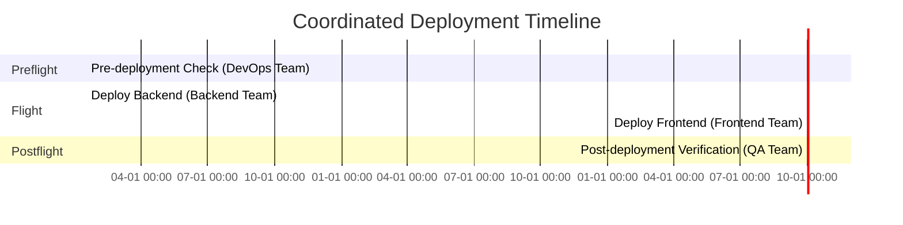

# Generating manuals

Turning an operation into a reviewable document: formats, metadata, single-environment manuals and timeline charts.

## Enhanced Manual Generation with Metadata

Generated manuals now include comprehensive YAML frontmatter with git metadata and traceability:

```bash
# Generate manual for all environments with metadata
npx github:eric4545/samaritan generate manual deployment.yaml

# Generate manual for production environment only
npx github:eric4545/samaritan generate manual deployment.yaml --env production

# Generate manual with resolved variables (ready-to-execute commands)
npx github:eric4545/samaritan generate manual deployment.yaml --env production --resolve-vars

# Generate one manual per environment in a single command
# deployment.yaml (environments: preprod, production) →
#   ./deployment_preprod.md  ./deployment_production.md
npx github:eric4545/samaritan generate manual deployment.yaml --all-envs

# Write the per-environment files to a directory, with a custom base name
#   →  out/release_preprod.md  out/release_production.md
npx github:eric4545/samaritan generate manual deployment.yaml --all-envs --output-dir out --prefix release
```

**Generated YAML frontmatter example:**
```yaml
---
source_file: "examples/deployment.yaml"
operation_id: "34ba0902-7669-4961-9038-fc17ace22fac"
operation_version: "1.1.0"
target_environment: "production"  # Only when --env specified
generated_at: "2025-09-25T17:03:26.350Z"
git_sha: "61b7299fecdec972c1bfcf8a02f539f05ae1986a"
git_branch: "001-i-want-to"
git_short_sha: "61b7299f"
git_author: "Eric Ng"
git_date: "2025-09-24 22:13:50 +0800"
git_message: "feat: restore TypeScript dependency..."
git_dirty: true
generator_version: "1.0.0"
---
```

**Variable Resolution Example:**

Without `--resolve-vars` (shows templates):
```bash
kubectl scale deployment web-server --replicas=${REPLICAS}
```

With `--resolve-vars` (ready-to-execute):
```bash
kubectl scale deployment web-server --replicas=5
```

**Code Block Protection:**

Variables inside fenced code blocks (` ``` `) are **protected from expansion** to preserve shell scripts and bash functions:

```yaml
common_variables:
  TIMESTAMP: $(date +%Y%m%d_%H%M%S)

steps:
  - name: Deploy with Timestamp Function
    instruction: |
      Use this bash function to capture deployment time:
      ```bash
      deploy() {
        local TIMESTAMP=$(date +%Y%m%d_%H%M%S)  # Stays literal
        echo "Deployed at ${TIMESTAMP}"          # Stays literal
      }
      ```
```

Even with `--resolve-vars`, the `${TIMESTAMP}` inside the code block remains as `${TIMESTAMP}` (not expanded to the YAML variable value). This prevents conflicts between YAML variables and bash/shell variables with the same name.

**Top-level `variables:`**

A top-level `variables:` map is a convenience alias for `common_variables:` — both are merged into the same shared variable pool used for `${VAR}` resolution across all environments. Precedence (highest to lowest) is:

```
common_variables > variables: > env_file
```

If the same key appears in both `variables:` and `common_variables:`, `common_variables:` wins. See `examples/top-level-variables.yaml`.

## Gantt Charts and Timeline Visualization

SAMARITAN can generate Mermaid Gantt charts to visualize operation timelines, making it easy to plan and coordinate complex deployments with multiple teams and dependencies.

**Adding Timeline Information to Steps:**

Add a `timeline` field to your steps to specify scheduling information:

```yaml
name: Coordinated Deployment
version: 1.0.0
description: Multi-team deployment with timeline coordination

environments:
  - name: production
    variables:
      REPLICAS: 5

steps:
  - name: Pre-deployment Check
    type: manual
    phase: preflight
    pic: DevOps Team
    instruction: Verify cluster health
    timeline:
      start: 2024-01-15 09:00
      duration: 30m

  - name: Deploy Backend
    type: manual
    phase: flight
    pic: Backend Team
    instruction: Deploy backend services
    timeline:
      status: active
      duration: 15m

  - name: Deploy Frontend
    type: manual
    phase: flight
    pic: Frontend Team
    instruction: Deploy frontend services
    timeline:
      after: Deploy Backend  # Dependency on previous step
      duration: 10m

  - name: Post-deployment Verification
    type: manual
    phase: postflight
    pic: QA Team
    instruction: Run smoke tests
    timeline:
      after: Deploy Frontend
      duration: 20m
```

**Timeline Field Options:**

- `start`: Absolute start time (format: `YYYY-MM-DD HH:mm`)
- `duration`: How long the step takes (e.g., `30m`, `2h`, `1d`)
- `after`: Dependency on another step (step name)
- `status`: Task status (`active`, `done`, `crit` for critical tasks)

**Generating Gantt Charts:**

```bash
# Generate manual with Gantt chart
npx github:eric4545/samaritan generate manual deployment.yaml --gantt

# Confluence markup, carrying the same Gantt chart
npx github:eric4545/samaritan generate manual deployment.yaml --gantt -f confluence --output deployment.confluence
```

::: tip
Confluence and ADF output are **formats of `generate manual`** (and `generate docs`),
not a separate subcommand. There is no `generate confluence` — use `-f confluence` or
`-f adf`. Note `--gantt` is a `generate manual` flag; `generate docs` does not accept it.
:::

**Generated Gantt Chart Example:**

The `--gantt` flag adds a Mermaid diagram to your manual:



**Key Features:**

- **Automatic Phase Grouping**: Steps are grouped by phase (preflight, flight, postflight)
- **Team Visualization**: PIC (Person In Charge) shown for each task
- **Dependency Tracking**: `after` creates visual dependencies between steps
- **Timeline Display**: Individual step timelines also shown in manual tables
- **Mermaid Integration**: Charts render in GitHub, Markdown viewers, and documentation tools

**Use Cases:**

- **Coordinated Releases**: Plan multi-team deployments with dependencies
- **Time-Critical Operations**: Visualize maintenance windows and deadlines
- **Progressive Rollouts**: Show canary deployment progression over time
- **Incident Response**: Timeline critical recovery procedures
- **Compliance Documentation**: Provide visual timeline evidence for audit trails

See `tests/fixtures/operations/confluence/gantt-timeline.yaml` for a complete example.

## Single-environment Markdown manual

Generate a clean, heading-based manual for a specific environment — optimised for reading *during* an operation rather than cross-env comparison:

```bash
# Single-env format (headings, no tables)
samaritan generate manual deployment.yaml --env production --output prod-manual.md

# Multi-env table format (default, no --env flag)
samaritan generate manual deployment.yaml --output full-manual.md
```

The `--env` format renders `## Step N: <name>` headings, `**Command**`/`**Verify**`/`Expected:` blocks, and `> PIC:`/`> Reviewer:` blockquotes — no tables. `Expected:` checks render as a checklist (`> - [ ] <check>`) so operators can tick off each verification criterion as they confirm it — mirroring the `> - [ ] PIC` sign-off checkboxes.

## Complete example

See [`examples/deployment-with-run.yaml`](https://github.com/eric4545/samaritan/blob/main/examples/deployment-with-run.yaml) for a full operation using:
- Two named sessions (execution over SSH, monitoring over SSH)
- `capture` to record the pre-deploy image tag for rollback reference
- `verify` with `expect` + `retry` on the monitoring session
- Array-format `rollback` steps on multiple steps
- `run.auto_send: false` / `run.auto_exec: false` (operator confirms each step)

Run it and automatically produce an evidence report:

```bash
samaritan run examples/deployment-with-run.yaml --env production --report ./evidence
```

Or preview the full plan without executing:

```bash
samaritan run examples/deployment-with-run.yaml --env production --dry-run
```
