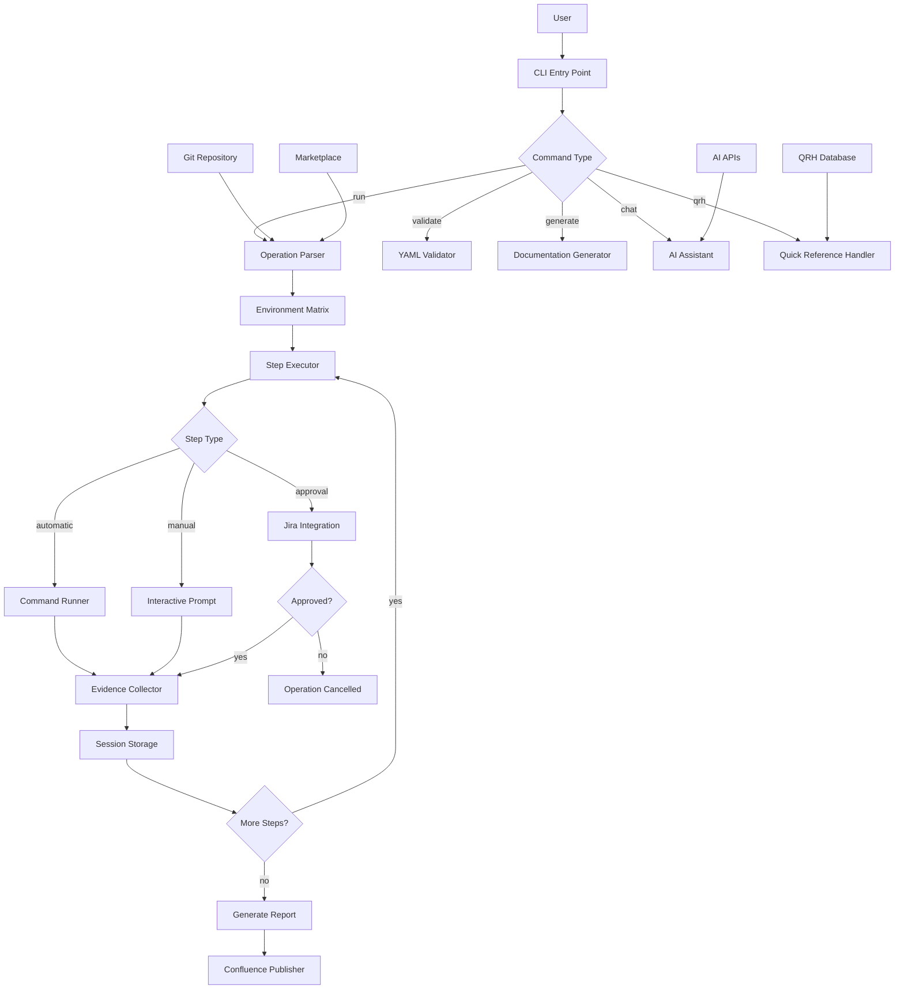
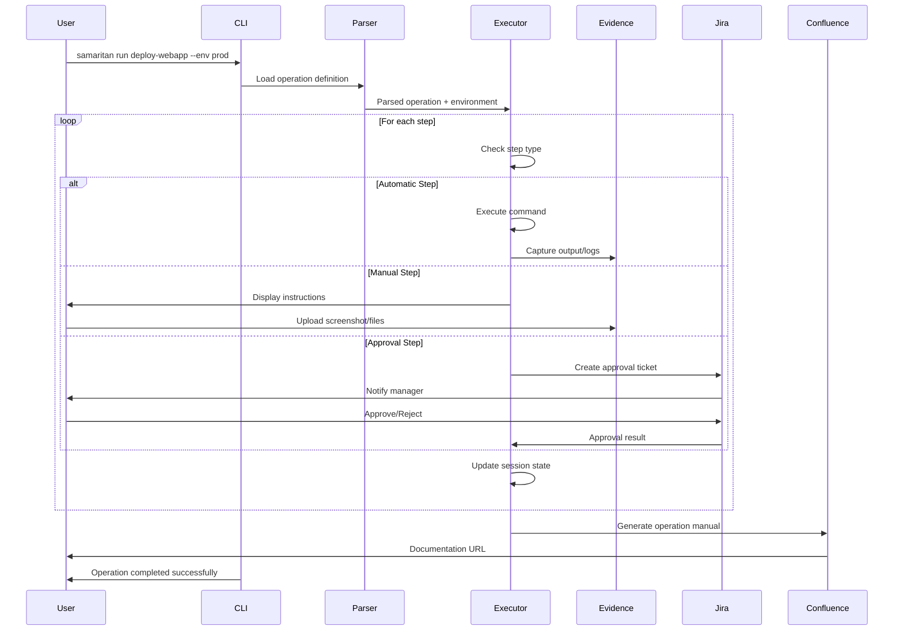

# Implementation Plan: SAMARITAN - Operation Manual Automation Tool

**Branch**: `001-i-want-to` | **Date**: 2025-09-09 | **Spec**: [spec.md](./spec.md)
**Input**: Feature specification from `/Users/ericng/Developments/github/eric4545/samaritan/specs/001-i-want-to/spec.md`

## Execution Flow (/plan command scope)
```
1. Load feature spec from Input path
   → If not found: ERROR "No feature spec at {path}"
2. Fill Technical Context (scan for NEEDS CLARIFICATION)
   → Detect Project Type from context (web=frontend+backend, mobile=app+api)
   → Set Structure Decision based on project type
3. Evaluate Constitution Check section below
   → If violations exist: Document in Complexity Tracking
   → If no justification possible: ERROR "Simplify approach first"
   → Update Progress Tracking: Initial Constitution Check
4. Execute Phase 0 → research.md
   → If NEEDS CLARIFICATION remain: ERROR "Resolve unknowns"
5. Execute Phase 1 → contracts, data-model.md, quickstart.md, agent-specific template file (e.g., `CLAUDE.md` for Claude Code, `.github/copilot-instructions.md` for GitHub Copilot, or `GEMINI.md` for Gemini CLI).
6. Re-evaluate Constitution Check section
   → If new violations: Refactor design, return to Phase 1
   → Update Progress Tracking: Post-Design Constitution Check
7. Plan Phase 2 → Describe task generation approach (DO NOT create tasks.md)
8. STOP - Ready for /tasks command
```

**IMPORTANT**: The /plan command STOPS at step 7. Phases 2-4 are executed by other commands:
- Phase 2: /tasks command creates tasks.md
- Phase 3-4: Implementation execution (manual or via tools)

## Summary
SAMARITAN is an interactive AI-powered Operations as Code platform for SRE teams that eliminates repetitive manual work by defining procedures once in Git-versioned YAML format. It executes operations across multiple environments with complete audit trails, automatic evidence collection, integrated approval workflows (Jira), and supports both automated and manual execution modes with real-time AI assistance.

## Technical Context
**Language/Version**: Node.js 24+ (latest LTS with enhanced performance and native TypeScript support)  
**Primary Dependencies**: Commander.js (CLI), yaml (parsing), inquirer (interactive prompts), chalk (terminal colors)  
**Storage**: Hybrid approach - local files + Git repos + Confluence API integration  
**Testing**: Jest for unit tests, integration tests with real Git/Confluence APIs  
**Target Platform**: Cross-platform CLI tool (Linux, macOS, Windows)
**Project Type**: single (CLI tool with library components)  
**Performance Goals**: <2s operation startup, handle 1000+ operation definitions  
**Constraints**: Must work offline for local operations, online for integrations  
**Scale/Scope**: Support enterprise SRE teams (50+ engineers, 500+ operations)

## Constitution Check
*GATE: Must pass before Phase 0 research. Re-check after Phase 1 design.*

**Simplicity**:
- Projects: 1 (CLI tool only)
- Using framework directly? Yes (Commander.js, no wrappers)
- Single data model? Yes (Operation, Step, Evidence entities)
- Avoiding patterns? Yes (direct file I/O, no Repository pattern)

**Architecture**:
- EVERY feature as library? Yes (operation-parser, executor, evidence-collector, ai-assistant)
- Libraries listed: operation-parser (YAML parsing), executor (step execution), evidence-collector (screenshot/logs), ai-assistant (interactive chat)
- CLI per library: samaritan --help/--version/--format, with subcommands (run, validate, generate, chat)
- Library docs: llms.txt format planned? Yes

**Testing (NON-NEGOTIABLE)**:
- RED-GREEN-Refactor cycle enforced? (test MUST fail first)
- Git commits show tests before implementation?
- Order: Contract→Integration→E2E→Unit strictly followed?
- Real dependencies used? (actual DBs, not mocks)
- Integration tests for: new libraries, contract changes, shared schemas?
- FORBIDDEN: Implementation before test, skipping RED phase

**Observability**:
- Structured logging included?
- Frontend logs → backend? (unified stream)
- Error context sufficient?

**Versioning**:
- Version number assigned? (MAJOR.MINOR.BUILD)
- BUILD increments on every change?
- Breaking changes handled? (parallel tests, migration plan)

## Project Structure

### Documentation (this feature)
```
specs/[###-feature]/
├── plan.md              # This file (/plan command output)
├── research.md          # Phase 0 output (/plan command)
├── data-model.md        # Phase 1 output (/plan command)
├── quickstart.md        # Phase 1 output (/plan command)
├── contracts/           # Phase 1 output (/plan command)
└── tasks.md             # Phase 2 output (/tasks command - NOT created by /plan)
```

### Source Code (repository root)
```
# Option 1: Single project (DEFAULT)
src/
├── models/
├── services/
├── cli/
└── lib/

tests/
├── contract/
├── integration/
└── unit/

# Option 2: Web application (when "frontend" + "backend" detected)
backend/
├── src/
│   ├── models/
│   ├── services/
│   └── api/
└── tests/

frontend/
├── src/
│   ├── components/
│   ├── pages/
│   └── services/
└── tests/

# Option 3: Mobile + API (when "iOS/Android" detected)
api/
└── [same as backend above]

ios/ or android/
└── [platform-specific structure]
```

**Structure Decision**: Option 1 (Single project - CLI tool with library components)

## Phase 0: Outline & Research
1. **Extract unknowns from Technical Context** above:
   - For each NEEDS CLARIFICATION → research task
   - For each dependency → best practices task
   - For each integration → patterns task

2. **Generate and dispatch research agents**:
   ```
   For each unknown in Technical Context:
     Task: "Research {unknown} for {feature context}"
   For each technology choice:
     Task: "Find best practices for {tech} in {domain}"
   ```

3. **Consolidate findings** in `research.md` using format:
   - Decision: [what was chosen]
   - Rationale: [why chosen]
   - Alternatives considered: [what else evaluated]

**Output**: research.md with all NEEDS CLARIFICATION resolved

## Phase 1: Design & Contracts
*Prerequisites: research.md complete*

1. **Extract entities from feature spec** → `data-model.md`:
   - Entity name, fields, relationships
   - Validation rules from requirements
   - State transitions if applicable

2. **Generate API contracts** from functional requirements:
   - For each user action → endpoint
   - Use standard REST/GraphQL patterns
   - Output OpenAPI/GraphQL schema to `/contracts/`

3. **Generate contract tests** from contracts:
   - One test file per endpoint
   - Assert request/response schemas
   - Tests must fail (no implementation yet)

4. **Extract test scenarios** from user stories:
   - Each story → integration test scenario
   - Quickstart test = story validation steps

5. **Update agent file incrementally** (O(1) operation):
   - Run `/scripts/update-agent-context.sh [claude|gemini|copilot]` for your AI assistant
   - If exists: Add only NEW tech from current plan
   - Preserve manual additions between markers
   - Update recent changes (keep last 3)
   - Keep under 150 lines for token efficiency
   - Output to repository root

**Output**: data-model.md, /contracts/*, failing tests, quickstart.md, agent-specific file

## SAMARITAN Architecture Flow





## Phase 2: Task Planning Approach
*This section describes what the /tasks command will do - DO NOT execute during /plan*

**Task Generation Strategy**:
- Load `/templates/tasks-template.md` as base
- Generate tasks from Phase 1 design docs (contracts, data model, quickstart)
- CLI interface contracts → CLI framework setup and command parsing tests [P]
- Integration API contracts → API client library tests [P]
- Data model entities → model validation and serialization tests [P]
- Core library creation tasks: operation-parser, executor, evidence-collector, ai-assistant
- CLI command implementation to wire together libraries
- Integration tests based on quickstart scenarios

**Ordering Strategy**:
- TDD order: Contract tests → Integration tests → Unit tests → Implementation
- Dependency order: Data models → Libraries → CLI → Integrations → Documentation
- Libraries can be developed in parallel [P] after models are defined
- CLI commands implemented after library interfaces are stable

**Specific Task Categories**:
1. **Foundation** (Tasks 1-5): Package setup, TypeScript config, testing framework
2. **Data Models** (Tasks 6-10): Core entities with validation and serialization  
3. **Library Development** [P] (Tasks 11-25): Four core libraries in parallel
4. **CLI Framework** (Tasks 26-30): Commander.js integration and command routing
5. **Integrations** (Tasks 31-35): Jira, Confluence, Git, PagerDuty clients
6. **Evidence Collection** (Tasks 36-40): Screenshot capture, file handling, validation
7. **AI Integration** (Tasks 41-45): OpenAI/Anthropic streaming chat implementation
8. **End-to-End** (Tasks 46-50): Full operation execution scenarios from quickstart

**Estimated Output**: 50 numbered, ordered tasks in tasks.md with clear [P] parallelization markers

**IMPORTANT**: This phase is executed by the /tasks command, NOT by /plan

## Phase 3+: Future Implementation
*These phases are beyond the scope of the /plan command*

**Phase 3**: Task execution (/tasks command creates tasks.md)  
**Phase 4**: Implementation (execute tasks.md following constitutional principles)  
**Phase 5**: Validation (run tests, execute quickstart.md, performance validation)

## Complexity Tracking
*Fill ONLY if Constitution Check has violations that must be justified*

| Violation | Why Needed | Simpler Alternative Rejected Because |
|-----------|------------|-------------------------------------|
| [e.g., 4th project] | [current need] | [why 3 projects insufficient] |
| [e.g., Repository pattern] | [specific problem] | [why direct DB access insufficient] |


## Progress Tracking
*This checklist is updated during execution flow*

**Phase Status**:
- [x] Phase 0: Research complete (/plan command)
- [x] Phase 1: Design complete (/plan command)
- [x] Phase 2: Task planning complete (/plan command - describe approach only)
- [x] Phase 3: Tasks generated (/tasks command)
- [x] Phase 4: Implementation complete ✅ **MVP SHIPPED** (2025-10-08)
- [x] Phase 5: Validation passed *(154/154 tests passing)*

**Gate Status**:
- [x] Initial Constitution Check: PASS
- [x] Post-Design Constitution Check: PASS
- [x] All NEEDS CLARIFICATION resolved
- [x] Complexity deviations documented (None - stayed within constitution)

**MVP Completion Summary** (2025-10-08):
- ✅ Core Features: YAML parsing, manual generation (MD/Confluence), Git metadata, evidence models
- ✅ CLI Framework: All core commands implemented (validate, generate, run, resume, qrh, init, create)
- ✅ Testing: 154 tests passing across 16 test suites
- ✅ Documentation: Comprehensive README.md with examples and usage instructions
- 🔮 Deferred: External integrations (Jira, Confluence, PagerDuty APIs), AI chat, formal contract tests

**Next Steps** (if needed in future):
1. Implement external API integrations (T025-T028)
2. Add AI assistant chat interface (T023, T033)
3. Create formal OpenAPI contract tests (T011-T015)
4. Add comprehensive JSDoc documentation (T037)

---
*Based on Constitution v2.1.1 - See `/memory/constitution.md`*